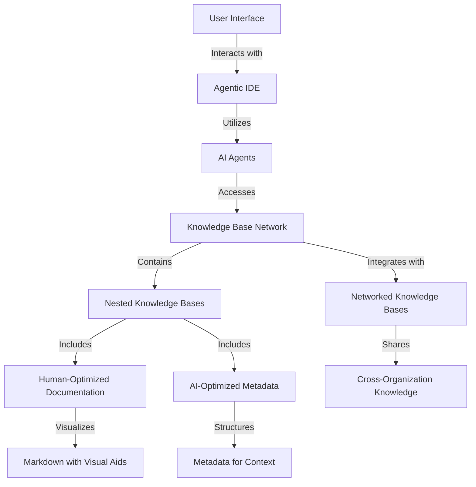
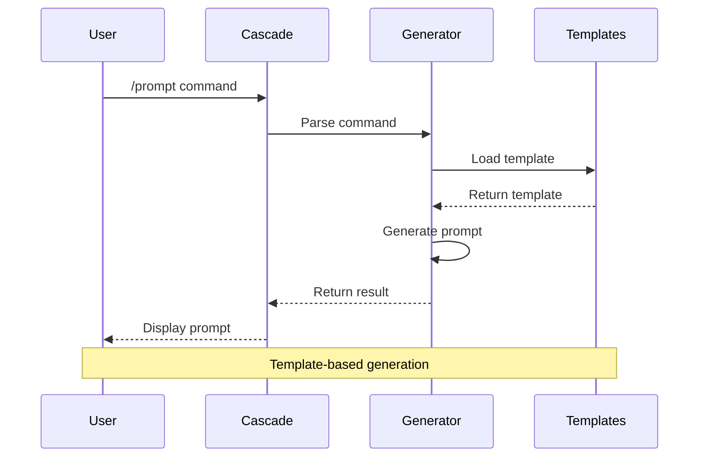
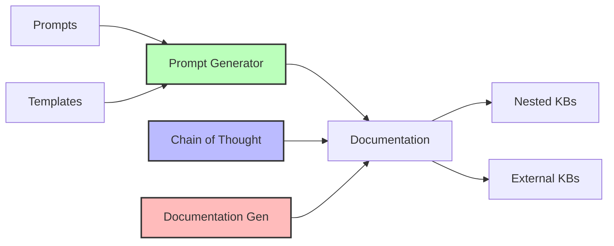

# Knowledge Base Network: Collaborative Intelligence System

A revolutionary approach to technical documentation that amplifies human-AI collaboration through networked knowledge sharing.

## Vision

This system transforms technical collaboration at two fundamental levels:

1. **Individual Intelligence**: Maximizing the collaborative potential between a single human and their AI agent in agentic IDEs like Windsurf
2. **Network Intelligence**: Creating a multiplier effect by enabling teams to share and build upon each other's human-AI collaborative experiences

## Core Innovation

### Dual-Mode Documentation
- **Human-Optimized**: Rich markdown with intuitive navigation and visual aids
- **AI-Optimized**: Structured metadata enabling deep contextual understanding
- **Synergistic Design**: Each mode complements the other, creating compound intelligence

### Knowledge Base Types

#### 1. Nested Knowledge Bases
- Maintained directly within this repository
- Full control over structure and content
- Example: `kb-network/kb-flowise-integration/`

#### 2. Networked Knowledge Bases
- Integrated via Git submodules
- Enables sharing across organizations
- Independent versioning and maintenance

## System Architecture



## Directory Structure
```
/
├── README.md                         # Root documentation
├── scripts/                          # Utility scripts
│   └── add_kb.sh                    # Script to add new KBs
├── prompting/                        # Prompt engineering patterns
│   ├── claude/                     # Claude-specific patterns
│   │   ├── system/               # System prompts
│   │   ├── tasks/                # Task prompts
│   │   └── examples/             # Example prompts
│   ├── doc_templates/               # Documentation templates
│   ├── code_review/                # Code review patterns
│   └── metadata_patterns/          # Metadata templates
└── kb-network/                       # Knowledge base network
    ├── kb-flowise-integration/       # Example nested KB
    └── external/                     # Networked KBs (submodules)
```

## Workflow Diagrams

### Prompt Generation Flow


### Knowledge Base Integration


## Prompt Generator

Our knowledge base includes a powerful prompt generation system that helps create consistent, high-quality prompts for AI interactions.

### Quick Start

1. **Using the CLI Command**
```bash
/prompt [task] [requirement1] [requirement2] ...
```

Example:
```bash
/prompt create API docs include-endpoints show-examples
```

2. **Using the Shell Script**
```bash
./scripts/prompt-gen.sh "Create API docs" "Include endpoints" "Show examples"
```

### Features
- Template-based prompt generation
- Built-in quality checks
- Chain of thought support
- Customizable output formats

### Documentation
Full documentation available in `/prompting/claude/prompt_generator/README.md`

### Templates
Pre-built templates for common tasks:
- API documentation
- Code review
- Technical documentation
- Chain of thought reasoning

## Project Documentation

This project is designed to facilitate the aggregation and organization of research and development efforts related to AI platforms. It includes a comprehensive knowledge base for storing ideas, notes, and references.

### Key Features

- **Knowledge Base**: A structured repository for storing and accessing AI platform-related information.
- **CLI Tools**: Includes scripts like `inject_note.sh` for efficiently managing and updating documentation.

### Using the inject_note.sh Script

The `inject_note.sh` script is a command-line tool that allows you to inject notes into specified sections of the `index.md` file within the knowledge base.

#### Usage

Run the script with the following command:

```bash
./scripts/inject_note.sh "Your note here" "Section Name"
```

- **Your note here**: The note you wish to add.
- **Section Name**: The section in the `index.md` where the note should be added (e.g., "Ideas", "Notes").

Ensure that the script has executable permissions and that you have the necessary rights to modify the `index.md` file.

## Network Effects

This system creates powerful network effects through:

1. **Experience Sharing**
   - Successful human-AI collaboration patterns are captured and shared
   - Teams learn from each other's AI-assisted solutions
   - Best practices emerge organically from collective usage

2. **Knowledge Multiplication**
   - Individual insights benefit the entire network
   - Each collaboration contributes to collective intelligence
   - Continuous feedback loop of improvement

3. **Cross-Pollination**
   - Ideas and solutions flow between teams
   - Common patterns are identified and refined
   - Innovation spreads rapidly through the network

## Getting Started

1. **Exploring Knowledge Bases**
   - Browse nested KBs in the `kb-network` directory
   - Each KB contains both human and machine-readable documentation
   - Start with the README in each KB for orientation

2. **Contributing**
   - Create new nested KBs for internal knowledge
   - Network external KBs via Git submodules
   - Maintain dual-mode documentation structure

3. **Best Practices**
   - Keep human and machine documentation in sync
   - Update metadata when adding new content
   - Share successful collaboration patterns

## Git Submodule Management

To effectively manage networked knowledge bases using Git submodules, follow these guidelines:

### Adding Knowledge Bases

#### Using the Script (Recommended)
```bash
# Add a new KB using the utility script
./scripts/add_kb.sh <repository-url> <kb-name>

# Example
./scripts/add_kb.sh https://github.com/org/their-kb.git awesome-kb
```
The script handles all necessary steps including:
- Creating required directories
- Adding the submodule
- Initializing and updating
- Committing changes

#### Manual Method
```bash
# Add a new KB as a submodule
git submodule add <repository-url> kb-network/external/<kb-name>

# Initialize and update
git submodule update --init --recursive

# Commit the addition
git add .
git commit -m "Add knowledge base: <kb-name>"
```

### Updating Knowledge Bases
```bash
# Update all submodules to their latest commits
git submodule update --remote

# Update a specific KB
git submodule update --remote kb-network/external/<kb-name>

# Commit the updates
git add kb-network/external/<kb-name>
git commit -m "Update knowledge base: <kb-name>"
```

### Cloning the Network
```bash
# Clone with all KBs
git clone --recursive <repository-url>

# Or after regular clone
git submodule update --init --recursive
```

### Removing Knowledge Bases
```bash
# Remove a KB
git submodule deinit kb-network/external/<kb-name>
git rm kb-network/external/<kb-name>
rm -rf .git/modules/kb-network/external/<kb-name>

# Commit the removal
git commit -m "Remove knowledge base: <kb-name>"
```

### Best Practices
1. **Version Control**
   - Always use `--recursive` when cloning or updating
   - Keep submodule references up to date
   - Use specific commits or tags for stability

2. **Documentation**
   - Document all networked KB dependencies
   - Maintain a list of required KBs
   - Include setup instructions for each KB

3. **Maintenance**
   - Regularly update submodules
   - Test after updating
   - Keep track of version compatibility

## License

Individual knowledge bases may have their own licensing terms. Please refer to each KB's documentation for specific details.

---
Last updated: February 15, 2025
