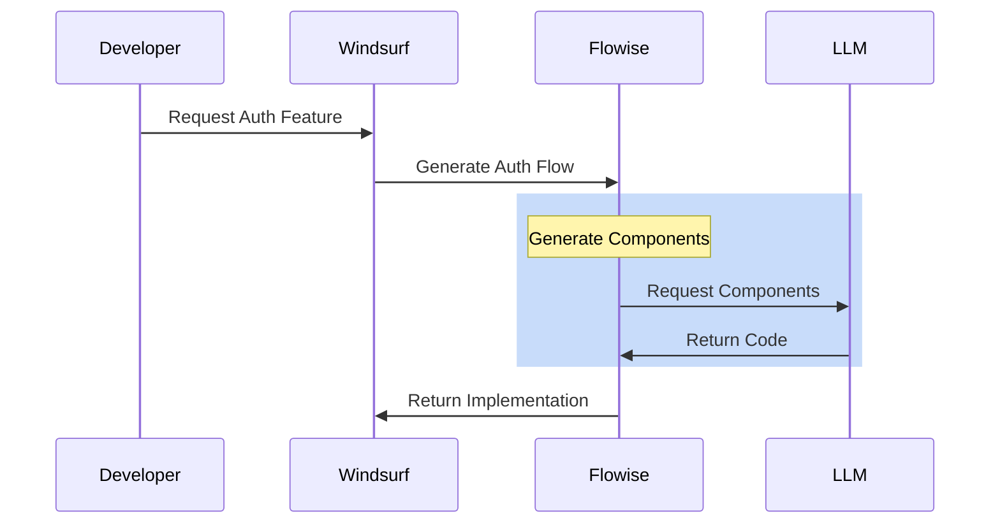
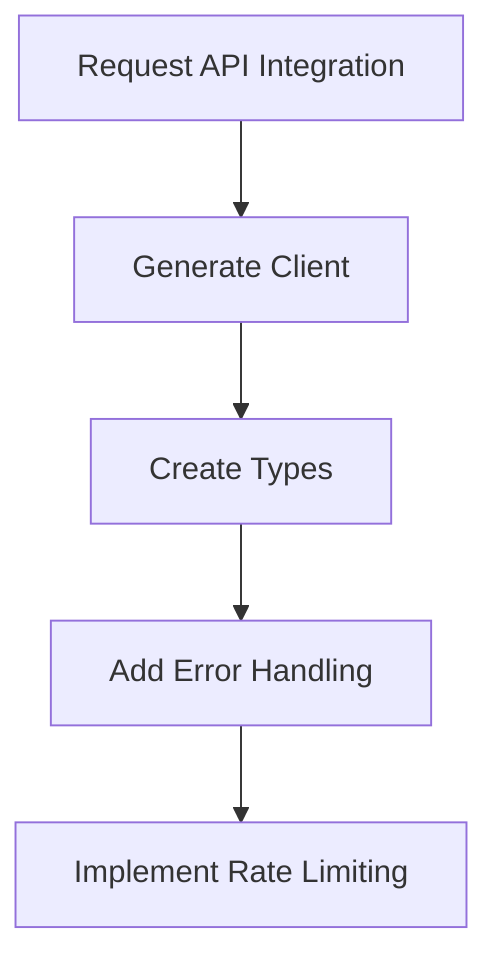
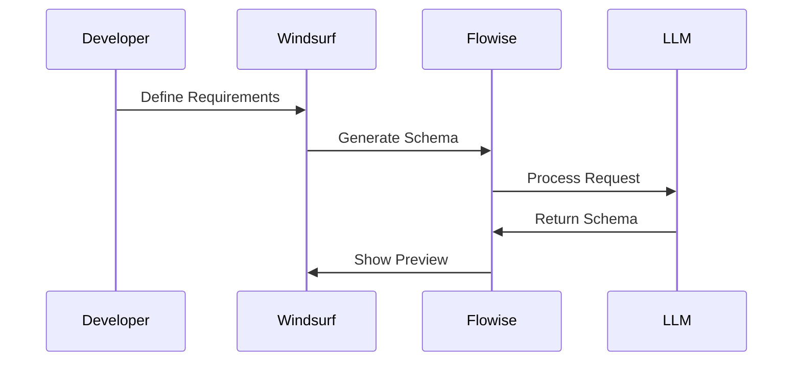
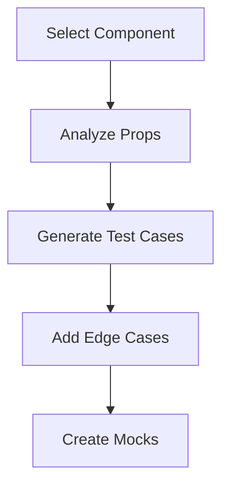
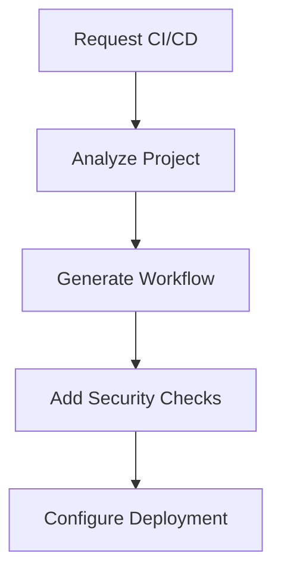

# Specific Implementation Examples

## 1. Full-Stack Feature Implementation

### User Authentication System


#### Generated Files
```typescript
// AuthContext.tsx
import React, { createContext, useContext, useState } from 'react';

interface AuthContextType {
    user: User | null;
    login: (credentials: LoginCredentials) => Promise<void>;
    logout: () => void;
}

export const AuthContext = createContext<AuthContextType>(null!);

// AuthProvider.tsx
export const AuthProvider: React.FC = ({ children }) => {
    const [user, setUser] = useState<User | null>(null);
    
    const login = async (credentials: LoginCredentials) => {
        // Implementation
    };
    
    const logout = () => {
        // Implementation
    };
    
    return (
        <AuthContext.Provider value={{ user, login, logout }}>
            {children}
        </AuthContext.Provider>
    );
};
```

## 2. API Integration Example

### OpenAI Integration


```typescript
// openai-client.ts
import { Configuration, OpenAIApi } from 'openai';

export class OpenAIClient {
    private api: OpenAIApi;
    private rateLimiter: RateLimiter;

    constructor(apiKey: string) {
        const configuration = new Configuration({ apiKey });
        this.api = new OpenAIApi(configuration);
        this.rateLimiter = new RateLimiter({
            maxRequests: 3,
            perSecond: 1
        });
    }

    async generateCode(prompt: string): Promise<string> {
        await this.rateLimiter.waitForToken();
        try {
            const response = await this.api.createCompletion({
                model: "gpt-4",
                prompt,
                max_tokens: 1500
            });
            return response.data.choices[0].text || '';
        } catch (error) {
            this.handleError(error);
            throw error;
        }
    }
}
```

## 3. Database Schema Generation

### MongoDB Schema


```typescript
// user.model.ts
import { Schema, model, Document } from 'mongoose';

interface IUser extends Document {
    username: string;
    email: string;
    password: string;
    profile: {
        firstName: string;
        lastName: string;
        avatar: string;
    };
    settings: {
        theme: 'light' | 'dark';
        notifications: boolean;
    };
    createdAt: Date;
    updatedAt: Date;
}

const UserSchema = new Schema<IUser>({
    username: { type: String, required: true, unique: true },
    email: { type: String, required: true, unique: true },
    password: { type: String, required: true },
    profile: {
        firstName: String,
        lastName: String,
        avatar: String
    },
    settings: {
        theme: { type: String, enum: ['light', 'dark'], default: 'light' },
        notifications: { type: Boolean, default: true }
    }
}, { timestamps: true });
```

## 4. Testing Suite Generation

### Component Testing


```typescript
// UserProfile.test.tsx
import { render, screen, waitFor } from '@testing-library/react';
import userEvent from '@testing-library/user-event';
import { UserProfile } from './UserProfile';
import { mockUserService } from '../__mocks__/userService';

jest.mock('../services/userService', () => mockUserService);

describe('UserProfile', () => {
    const defaultProps = {
        userId: 'test-123',
        showSettings: true
    };

    beforeEach(() => {
        mockUserService.getUser.mockClear();
    });

    it('renders user information correctly', async () => {
        render(<UserProfile {...defaultProps} />);
        
        expect(screen.getByTestId('loading')).toBeInTheDocument();
        
        await waitFor(() => {
            expect(screen.getByText('John Doe')).toBeInTheDocument();
            expect(screen.getByText('john@example.com')).toBeInTheDocument();
        });
    });

    it('handles error states appropriately', async () => {
        mockUserService.getUser.mockRejectedValueOnce(new Error('Failed to fetch'));
        
        render(<UserProfile {...defaultProps} />);
        
        await waitFor(() => {
            expect(screen.getByText('Error loading profile')).toBeInTheDocument();
        });
    });
});
```

## 5. CI/CD Pipeline Generation

### GitHub Actions Workflow


```yaml
# .github/workflows/main.yml
name: CI/CD Pipeline

on:
  push:
    branches: [ main ]
  pull_request:
    branches: [ main ]

jobs:
  test:
    runs-on: ubuntu-latest
    steps:
      - uses: actions/checkout@v2
      - name: Setup Node.js
        uses: actions/setup-node@v2
        with:
          node-version: '18'
      - name: Install Dependencies
        run: npm ci
      - name: Run Tests
        run: npm test
      - name: Run Linting
        run: npm run lint
      
  security:
    needs: test
    runs-on: ubuntu-latest
    steps:
      - uses: actions/checkout@v2
      - name: Security Scan
        uses: snyk/actions/node@master
        env:
          SNYK_TOKEN: ${{ secrets.SNYK_TOKEN }}
          
  deploy:
    needs: security
    runs-on: ubuntu-latest
    if: github.ref == 'refs/heads/main'
    steps:
      - name: Deploy to Production
        run: |
          echo "Deploying to production..."
```
