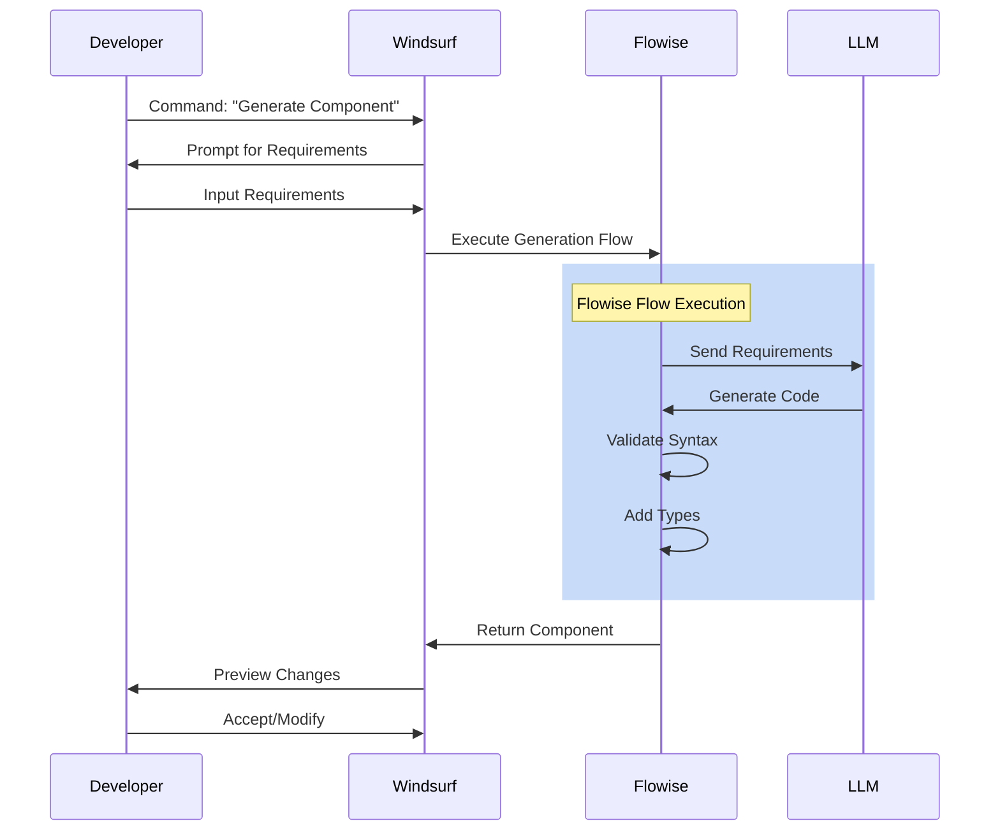
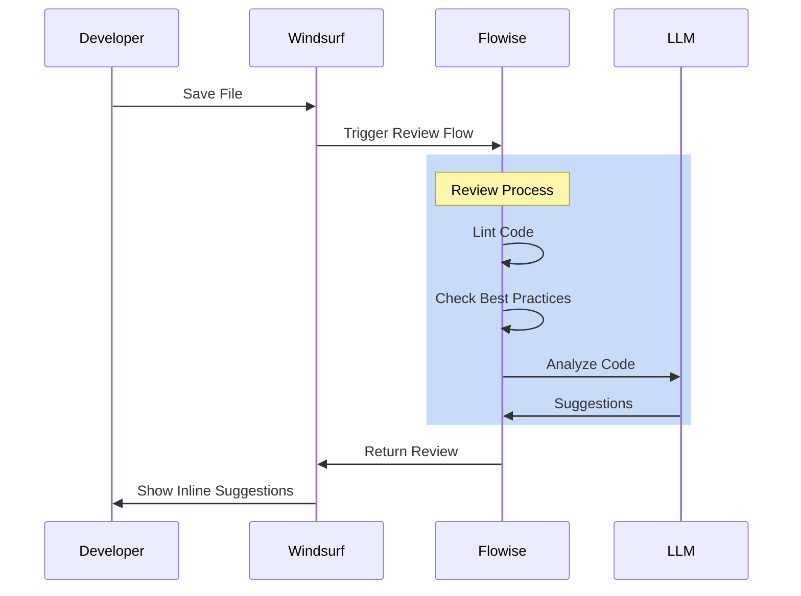
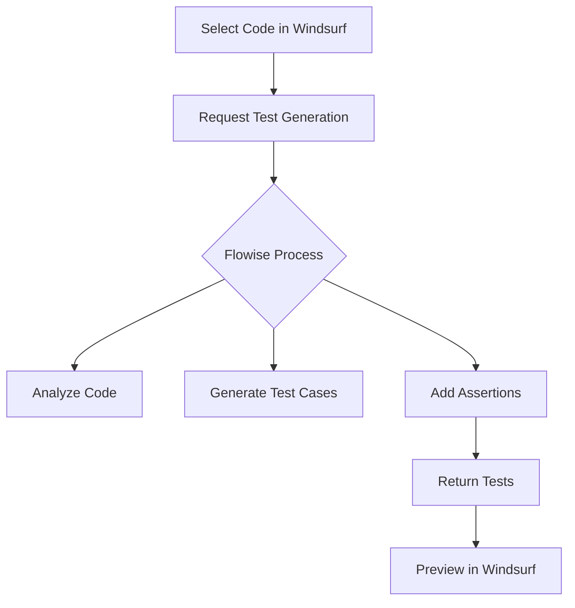
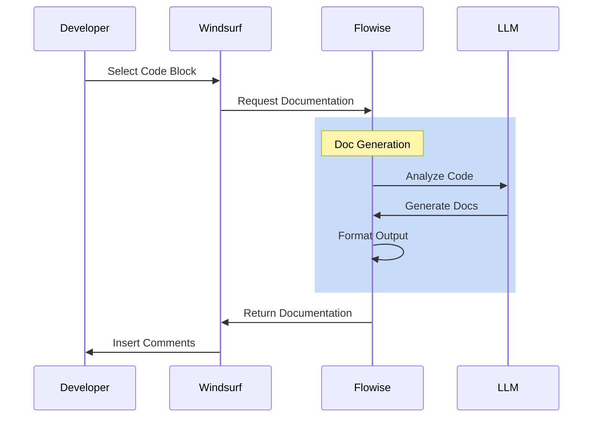

# Windsurf + Flowise Workflow Examples

## 1. Code Generation Workflow

### React Component Generation


### Example Usage
1. Press `Cmd/Ctrl + Shift + P`
2. Type "Generate React Component"
3. Input requirements:
   ```json
   {
     "name": "UserProfile",
     "features": ["avatar", "bio", "stats"],
     "styling": "styled-components",
     "typescript": true
   }
   ```
4. Review generated code
5. Accept or modify

## 2. Code Review Process

### Automated Code Review


### Example Review Comments
```typescript
// Original code
function fetchUser(id) {
    return fetch('/api/users/' + id)
        .then(res => res.json())
}

// Flowise suggestions
// 1. Add type safety: 'id: string'
// 2. Add error handling
// 3. Use template literals
// 4. Consider async/await
```

## 3. Test Generation

### Automated Test Creation


### Example Test Generation
```typescript
// Original component
const UserProfile = ({ userId }: { userId: string }) => {
    const [user, setUser] = useState<User | null>(null);
    // ... component logic
}

// Generated test
describe('UserProfile', () => {
    it('should load user data on mount', async () => {
        const userId = 'test-123';
        render(<UserProfile userId={userId} />);
        expect(screen.getByTestId('loading')).toBeInTheDocument();
        await waitFor(() => {
            expect(screen.getByText('User Profile')).toBeInTheDocument();
        });
    });
});
```

## 4. Documentation Generation

### Auto-Documentation Flow


### Example Documentation
```typescript
// Before
const processUserData = (data: RawUserData) => {
    const { name, email, preferences } = data;
    return {
        displayName: name.trim(),
        contact: email.toLowerCase(),
        settings: preferences || defaultPreferences
    };
}

// After (Generated by Flowise)
/**
 * Processes raw user data into a standardized format
 * @param {RawUserData} data - The raw user data object
 * @returns {ProcessedUserData} Formatted user data with defaults
 * 
 * @example
 * const rawData = { name: " John Doe ", email: "JOHN@example.com" };
 * const processed = processUserData(rawData);
 * // Returns: { displayName: "John Doe", contact: "john@example.com", ... }
 * 
 * @throws {Error} If required fields are missing
 */
```

## Using Windsurf Commands

### Common Command Palette Actions
1. `Generate Component` - Create new React components
2. `Review Code` - Trigger code review
3. `Generate Tests` - Create test cases
4. `Document Code` - Generate documentation
5. `Explain Code` - Get code explanation
6. `Optimize Code` - Suggest optimizations

### Keyboard Shortcuts
- `Cmd/Ctrl + Shift + G` - Generate code
- `Cmd/Ctrl + Shift + R` - Review current file
- `Cmd/Ctrl + Shift + T` - Generate tests
- `Cmd/Ctrl + Shift + D` - Generate documentation

## Best Practices
1. Always review generated code
2. Customize templates for your needs
3. Keep LLM prompts specific
4. Version control your Flowise flows
5. Share successful workflows with team
