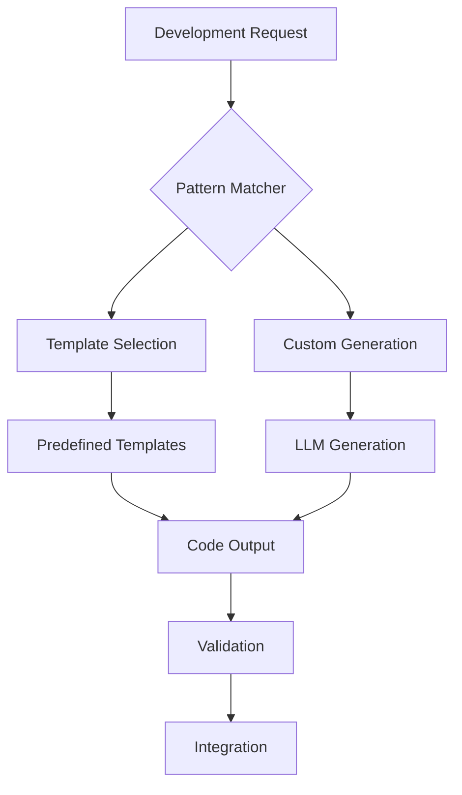
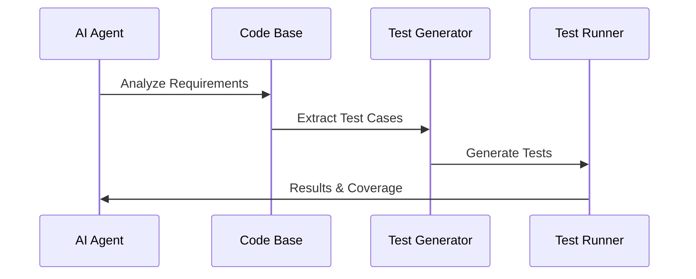
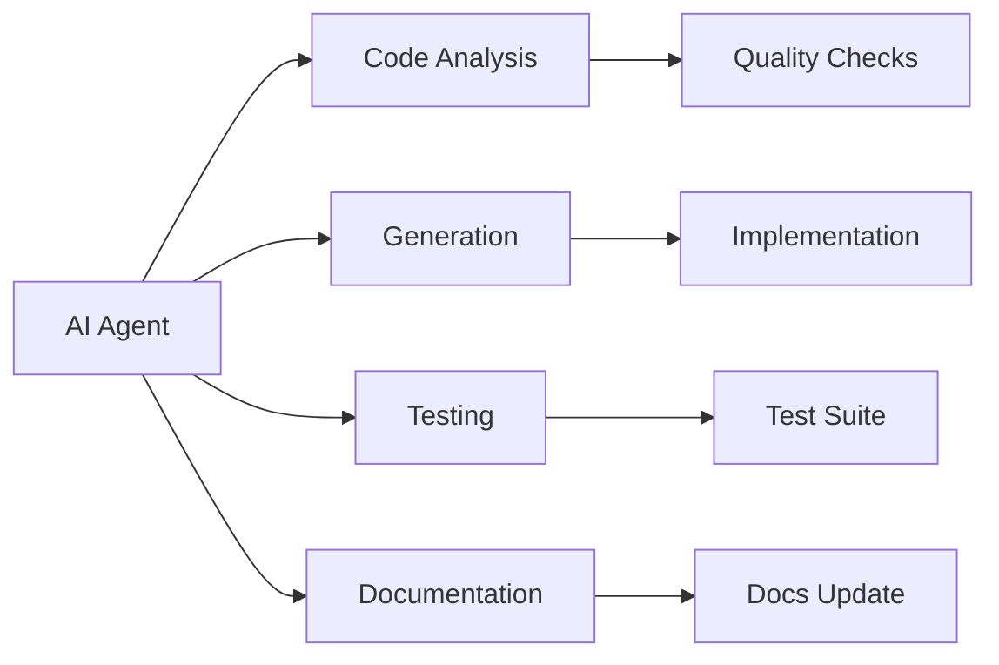

# AI Development Patterns

---
type: ai-interface
version: 1.1
purpose: development-automation
last_updated: 2025-02-15
---

## Code Generation Patterns



## Implementation Templates

### Component Generation
```json
{
  "type": "component_request",
  "parameters": {
    "framework": "react",
    "style": "functional",
    "features": ["state", "effects", "props"],
    "testing": true
  },
  "response": {
    "files": [
      "component.tsx",
      "styles.css",
      "tests.tsx"
    ],
    "documentation": "README.md"
  }
}
```

### API Integration
```json
{
  "type": "api_integration",
  "parameters": {
    "method": "POST",
    "authentication": "bearer",
    "response_type": "json",
    "error_handling": true
  },
  "response": {
    "code": "implementation",
    "tests": "integration_tests",
    "docs": "api_documentation"
  }
}
```

## Testing Patterns



## Documentation Generation

### Structure
```json
{
  "documentation_types": {
    "code": {
      "format": "JSDoc/TSDoc",
      "scope": ["functions", "classes", "interfaces"]
    },
    "api": {
      "format": "OpenAPI/Swagger",
      "scope": ["endpoints", "models", "security"]
    },
    "usage": {
      "format": "Markdown",
      "scope": ["setup", "examples", "configuration"]
    }
  }
}
```

## Integration Points


