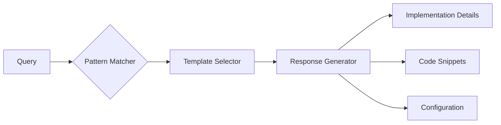

# AI Query Patterns

---
type: ai-interface
version: 1.0
purpose: query-documentation
---

## Query Pattern Templates

### Code Generation Query
```json
{
  "type": "code-generation",
  "parameters": {
    "language": "string",
    "framework": "string",
    "purpose": "string",
    "constraints": "array"
  },
  "response_format": {
    "code": "string",
    "explanation": "string",
    "dependencies": "array"
  }
}
```

### Implementation Search
```json
{
  "type": "implementation-search",
  "parameters": {
    "concept": "string",
    "use_case": "string",
    "requirements": "array"
  },
  "response_format": {
    "template": "string",
    "configuration": "object",
    "examples": "array"
  }
}
```

## Response Templates


