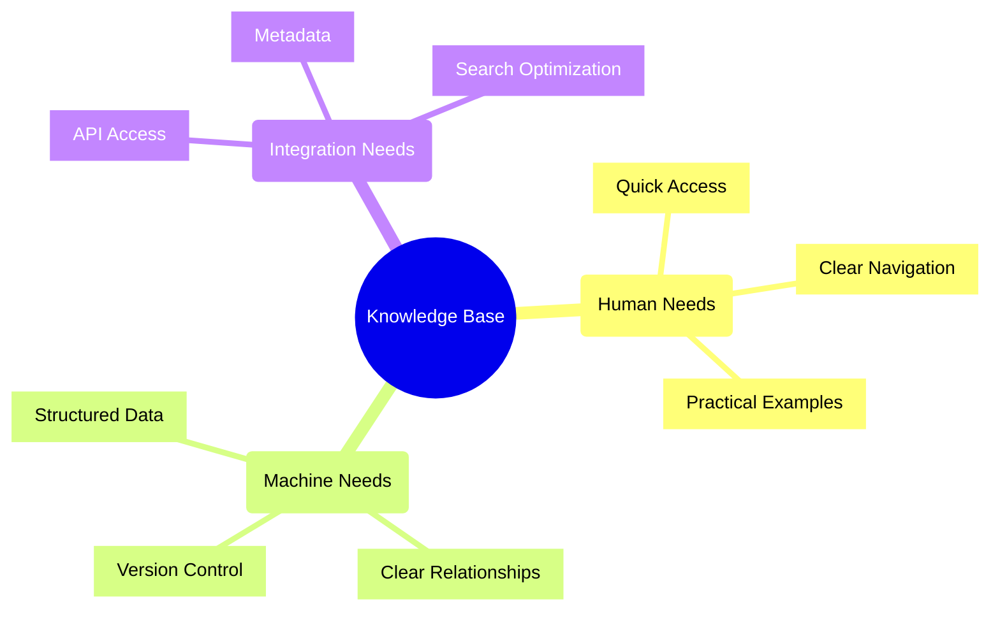
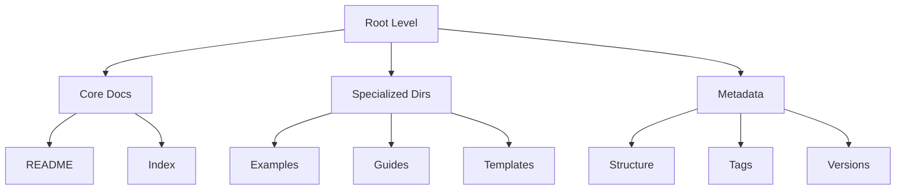
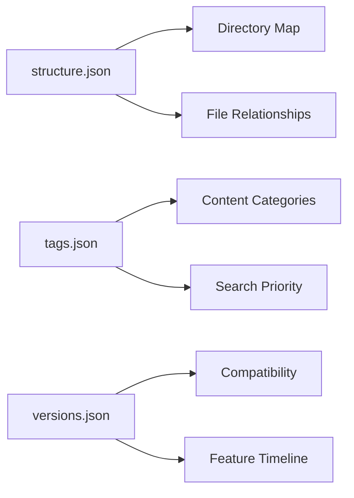
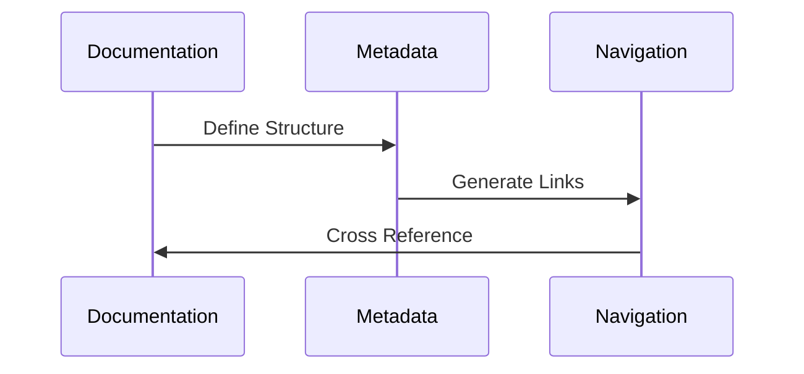
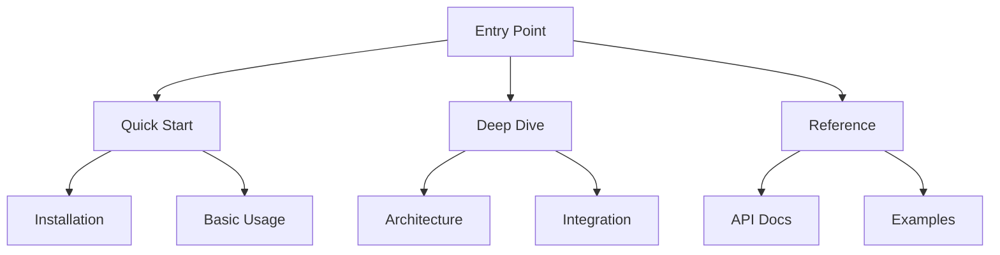
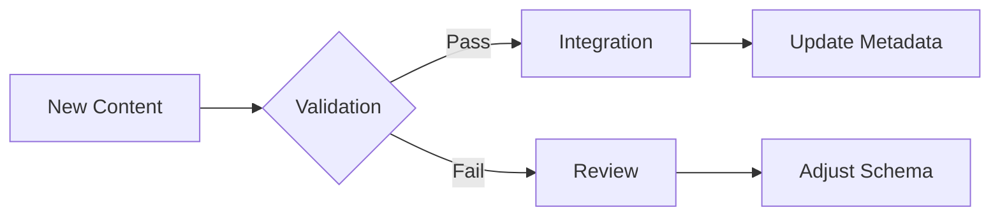
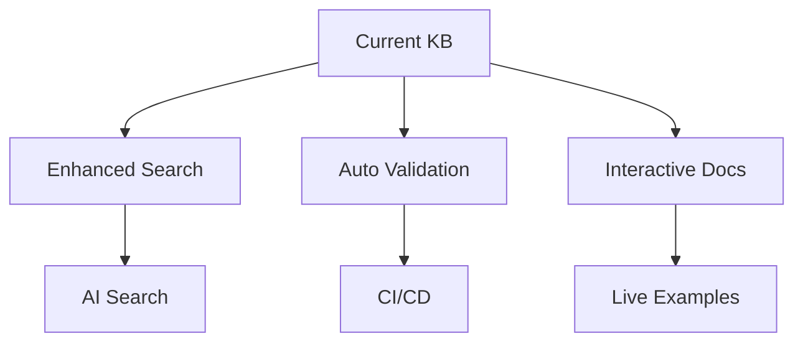
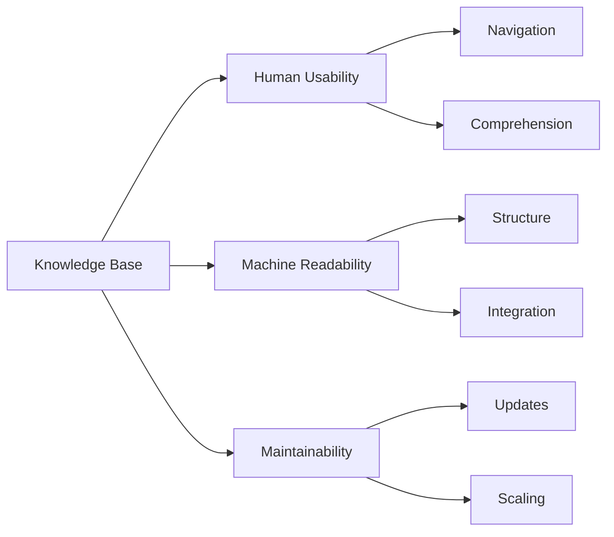

# Cognitive Workflow: Creating the Flowise Knowledge Base

## 1. Initial Analysis Phase

### Problem Understanding

### Key Considerations
1. **Dual Audience**
   - Human readers need intuitive navigation
   - Machines need structured data
   - Both need consistent organization

2. **Content Types**
   - Documentation (MD files)
   - Code Examples
   - Flow Templates
   - Configuration Files

## 2. Design Decisions

### Directory Structure

**Rationale:**
1. Separate concerns for clarity
2. Group related content
3. Minimize nesting depth
4. Enable easy discovery

### Metadata Layer

**Design Goals:**
1. Machine-readable first
2. Clear relationships
3. Extensible structure
4. Version awareness

## 3. Implementation Strategy

### Phase 1: Core Structure
1. Create base directories
2. Define metadata schema
3. Establish file naming conventions

### Phase 2: Content Organization

### Phase 3: Machine Optimization
1. JSON schemas for validation
2. Relationship mapping
3. Search indexing
4. Version tracking

## 4. Key Insights

### Documentation Patterns

### Content Organization
1. **Progressive Disclosure**
   - Start with basics
   - Lead to complex topics
   - Link related content

2. **Dual-Purpose Content**
   - Human-readable markdown
   - Machine-readable metadata
   - Cross-referenced structure

## 5. Evolution Considerations

### Maintainability

### Scalability
1. **Content Growth**
   - Modular structure
   - Clear categorization
   - Version control

2. **Integration Expansion**
   - API-first approach
   - Extensible schemas
   - Clear documentation

## 6. Lessons Learned

### Successful Approaches
1. Separating human and machine concerns
2. Using JSON for structured metadata
3. Implementing clear navigation patterns
4. Creating comprehensive examples

### Areas for Improvement
1. More automated validation
2. Enhanced search capabilities
3. Better version management
4. More interactive examples

## 7. Future Considerations

### Planned Enhancements

### Integration Opportunities
1. **IDE Integration**
   - Direct documentation access
   - Context-aware help
   - Code snippets

2. **AI Assistance**
   - Smart search
   - Content generation
   - Example creation

## 8. Best Practices Established

### Documentation Standards
1. Clear file naming
2. Consistent structure
3. Complete metadata
4. Cross-referencing

### Metadata Management
1. Schema validation
2. Relationship mapping
3. Version tracking
4. Search optimization

## 9. Conclusion

### Success Metrics

### Final Thoughts
1. Balance human and machine needs
2. Prioritize maintainability
3. Enable easy discovery
4. Support future growth
