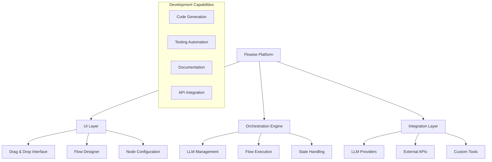
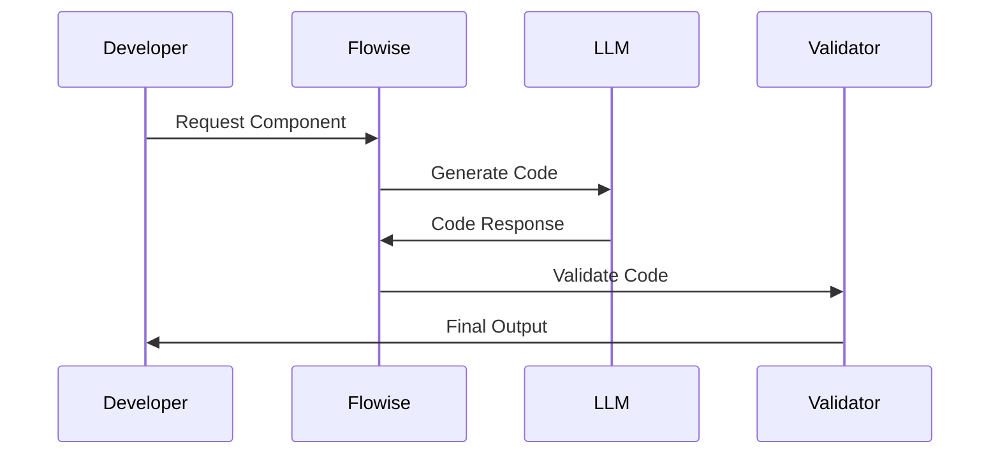
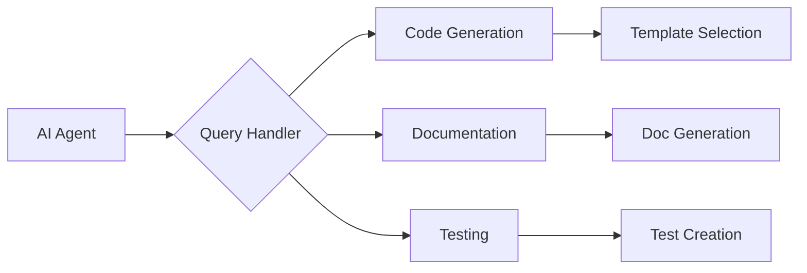

# Flowise Core Concepts

---
type: concept
version: 1.1
tags: [core, llm, orchestration, agents]
last_updated: 2025-02-15
---

## What is Flowise?

Flowise is an open-source low-code tool designed for developers to build customized LLM orchestration flows and AI agents. It emphasizes rapid iteration and development through a drag-and-drop UI approach.

## System Architecture



## Installation Methods

```json
{
  "requirements": {
    "nodejs": ">=18.15.0"
  },
  "installation": {
    "npm": "npm install -g flowise",
    "start": "npx flowise start",
    "with_auth": "npx flowise start --FLOWISE_USERNAME=user --FLOWISE_PASSWORD=1234"
  },
  "docker": {
    "compose": "docker-compose up -d",
    "standalone": "docker run -d -p 3000:3000 flowiseai/flowise"
  }
}
```

## AI Development Features

### 1. Code Generation


### 2. Testing Integration
```json
{
  "test_capabilities": {
    "unit_testing": {
      "frameworks": ["Jest", "Mocha"],
      "automation": true
    },
    "integration_testing": {
      "api_testing": true,
      "flow_validation": true
    }
  }
}
```

### 3. Documentation Generation
- Automatic JSDoc/TSDoc generation
- README updates
- API documentation
- Flow diagrams

## AI Agent Integration Points

```json
{
  "agent_interfaces": {
    "code_generation": {
      "input": "natural language",
      "output": "validated code",
      "supported_languages": [
        "JavaScript",
        "TypeScript",
        "Python"
      ]
    },
    "code_review": {
      "capabilities": [
        "style checking",
        "security analysis",
        "performance review"
      ]
    },
    "testing": {
      "types": [
        "unit tests",
        "integration tests",
        "e2e tests"
      ]
    }
  }
}
```

## Query Patterns for AI Agents


