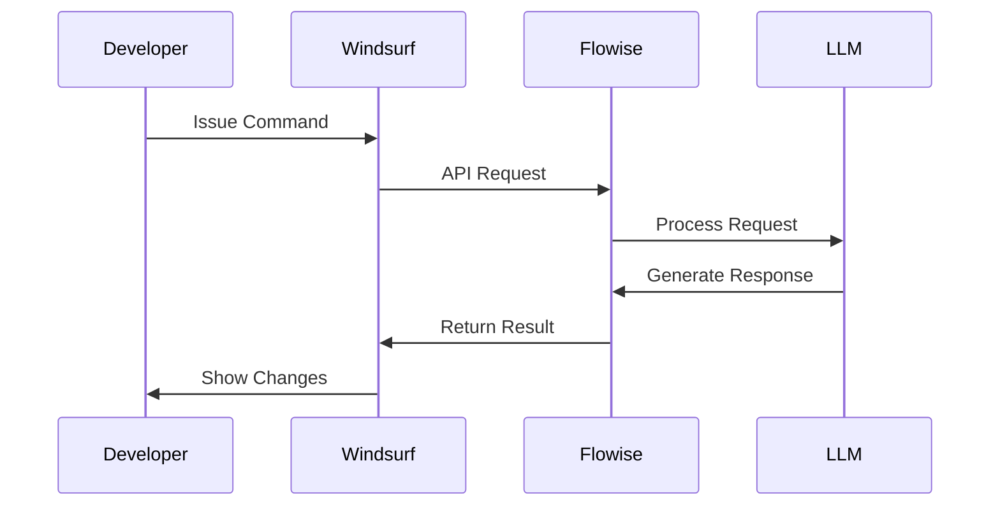
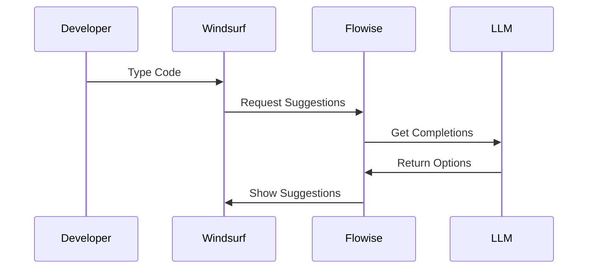
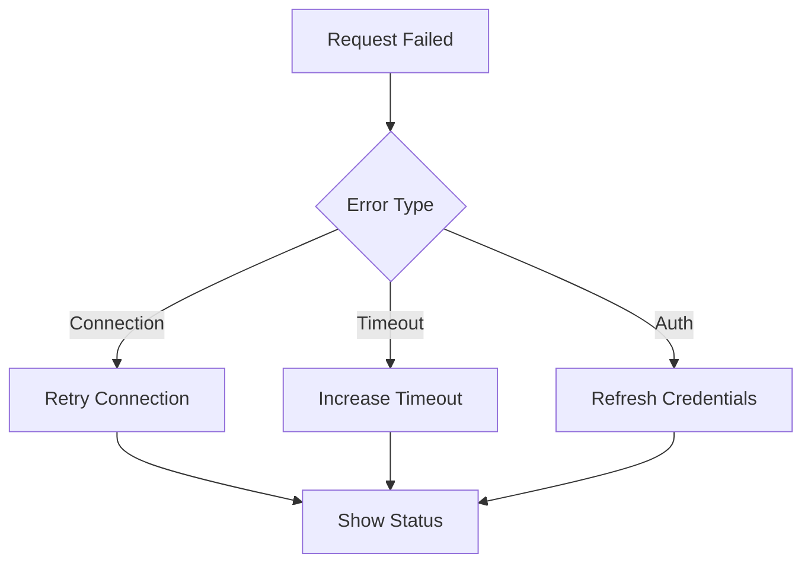

# Windsurf-Flowise Integration Guide

## How Windsurf Uses Flowise

### 1. Command Processing


### 2. Real-time Code Assistance
```typescript
// Example: When you type in Windsurf
function calculateTotal(items) {
    // Windsurf detects potential improvement
    // Automatically queries Flowise
    // Suggests:
    function calculateTotal(items: CartItem[]): number {
        return items.reduce((sum, item) => sum + item.price, 0);
    }
}
```

## Integration Points

### 1. Command Palette Integration
```json
{
  "windsurf.commands": {
    "flowise.generateCode": {
      "title": "Generate Code",
      "shortcut": "cmd+shift+g",
      "flow": "code-generation"
    },
    "flowise.reviewCode": {
      "title": "Review Code",
      "shortcut": "cmd+shift+r",
      "flow": "code-review"
    }
  }
}
```

### 2. Context Menu Actions
```json
{
  "editor.contextMenu": {
    "flowise.explain": "Explain Code",
    "flowise.optimize": "Optimize Code",
    "flowise.test": "Generate Tests"
  }
}
```

### 3. Auto-completion Integration


## How It Works

### 1. Code Generation
```typescript
// Windsurf internal process
async function handleCodeGeneration(prompt: string) {
    // 1. Capture context
    const context = editor.getSelection();
    
    // 2. Send to Flowise
    const response = await flowise.execute({
        flow: 'code-generation',
        input: {
            prompt,
            context,
            language: editor.getLanguage()
        }
    });
    
    // 3. Apply changes
    editor.applyEdit(response.code);
}
```

### 2. Code Review
```typescript
// Windsurf review process
async function handleCodeReview(file: string) {
    // 1. Get file content
    const content = editor.getContent();
    
    // 2. Send to Flowise
    const review = await flowise.execute({
        flow: 'code-review',
        input: {
            code: content,
            language: file.extension
        }
    });
    
    // 3. Show inline comments
    editor.addReviewComments(review.suggestions);
}
```

## Configuration

### 1. Flowise Connection
```json
{
  "flowise": {
    "endpoint": "http://localhost:3000",
    "auth": {
      "type": "basic",
      "username": "${FLOWISE_USERNAME}",
      "password": "${FLOWISE_PASSWORD}"
    },
    "timeout": 30000
  }
}
```

### 2. Flow Templates
```json
{
  "templates": {
    "code-generation": {
      "path": "./flows/code-gen.json",
      "timeout": 15000
    },
    "code-review": {
      "path": "./flows/review.json",
      "timeout": 20000
    }
  }
}
```

## Error Handling

### 1. Connection Issues


### 2. Response Validation
```typescript
interface FlowiseResponse {
    success: boolean;
    data?: {
        code?: string;
        suggestions?: Array<{
            line: number;
            message: string;
        }>;
    };
    error?: string;
}

// Windsurf validation
function validateResponse(response: FlowiseResponse) {
    if (!response.success) {
        showError(response.error);
        return false;
    }
    return true;
}
```

## Best Practices

### 1. Prompt Engineering
- Be specific in requirements
- Include context
- Specify output format
- Handle edge cases

### 2. Performance
- Cache common responses
- Use appropriate timeouts
- Implement retry logic
- Monitor response times

### 3. Security
- Store credentials securely
- Validate all responses
- Limit API access
- Regular updates

## Troubleshooting

### Common Issues
1. Connection timeout
   - Check Flowise server status
   - Verify network connection
   - Adjust timeout settings

2. Authentication failed
   - Verify credentials
   - Check environment variables
   - Refresh API tokens

3. Invalid responses
   - Check flow configuration
   - Verify API endpoints
   - Review error logs
