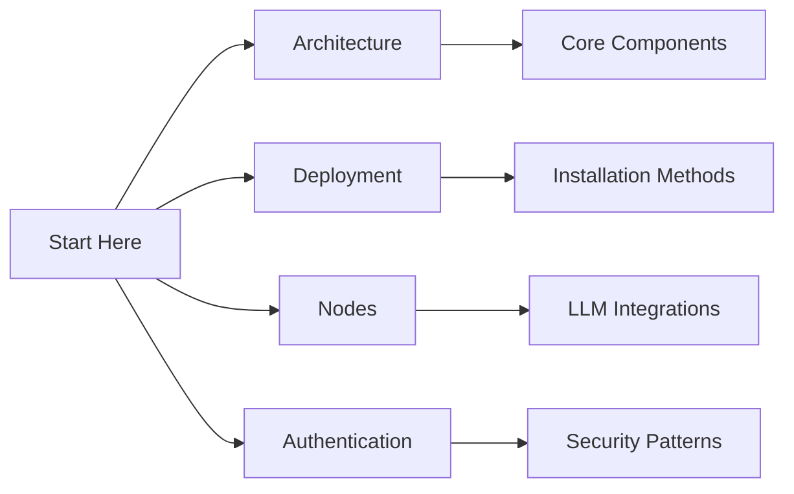

# Flowise Knowledge Index

## Documentation Map
1. [Architecture Overview](architecture.md)
2. [Deployment Guide](deployment.md)
3. [Node Reference](nodes-reference.md)
4. [Authentication Flows](authentication.md)
