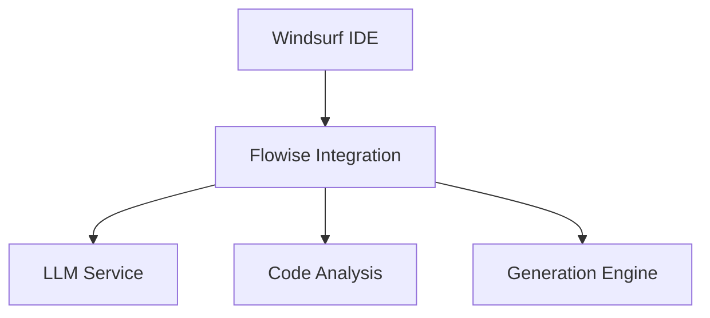
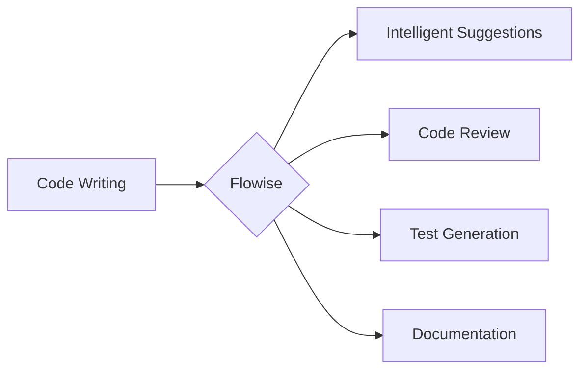
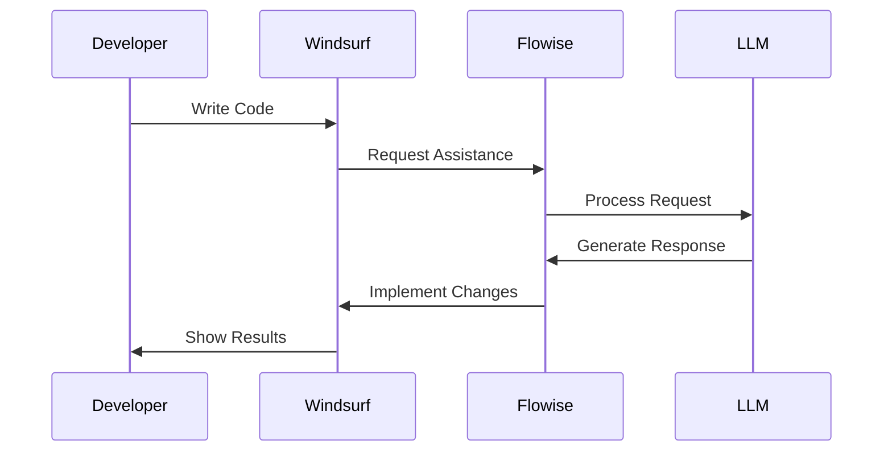

# Flowise Integration Knowledge Base

> 📖 Welcome to the Flowise Integration Knowledge Base! This documentation covers everything you need to know about integrating Flowise with Windsurf IDE. For machine-readable metadata, see `metadata/structure.json`.

## Quick Links
1. [Setup Guide](setup/installation.md) - Get started with Flowise
2. [Integration Guide](integration/windsurf-flowise.md) - Connect with Windsurf
3. [Workflow Examples](examples/workflows.md) - See it in action

## Core Components

### 1. System Architecture


### 2. Development Workflows


### 3. Request-Response Flow


## Getting Started

1. **Installation**
   - Follow the [setup guide](setup/installation.md)
   - Configure environment variables
   - Verify system connectivity

2. **Basic Usage**
   - Code completion and suggestions
   - Automated code review
   - Test generation
   - Documentation assistance

3. **Advanced Features**
   - Custom workflow creation
   - Team collaboration setup
   - CI/CD pipeline integration

## Documentation Structure
```
./
├── ai-interfaces/      # AI integration APIs
├── setup/              # Installation guides
├── integration/        # System integration
├── examples/           # Usage examples
├── concepts/           # Core concepts
└── metadata/          # Machine-readable data
```

## Features

### 1. Intelligent Code Assistance
- Real-time code suggestions
- Context-aware completions
- Automated refactoring
- Pattern recognition

### 2. Development Workflow Enhancement
- Automated code review
- Test case generation
- Documentation updates
- Performance optimization

### 3. Team Collaboration
- Shared coding standards
- Consistent code patterns
- Knowledge preservation
- Best practice enforcement

## Additional Resources
- [Troubleshooting Guide](setup/troubleshooting.md)
- [API Reference](ai-interfaces/api-reference.md)
- [Best Practices](integration/best-practices.md)
- [Performance Tuning](setup/performance.md)

---
This documentation uses dual-mode structure to serve both human readers and AI systems effectively.


## License

Please refer to individual knowledge base directories for their specific licensing information.

---
Last updated: February 15, 2025
