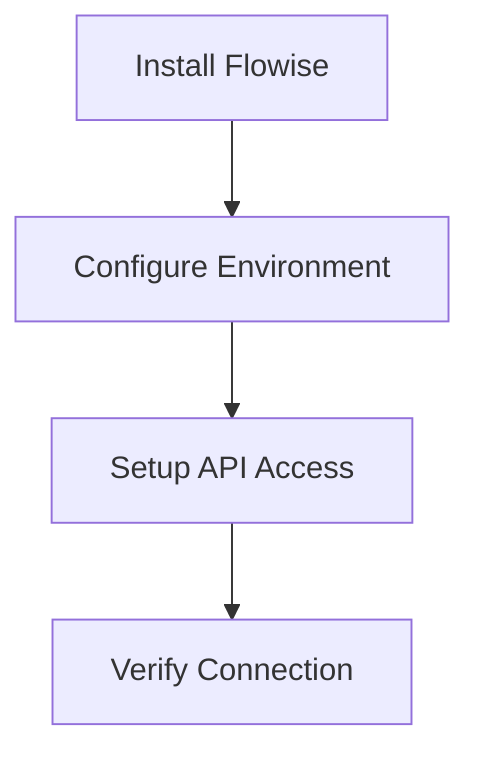
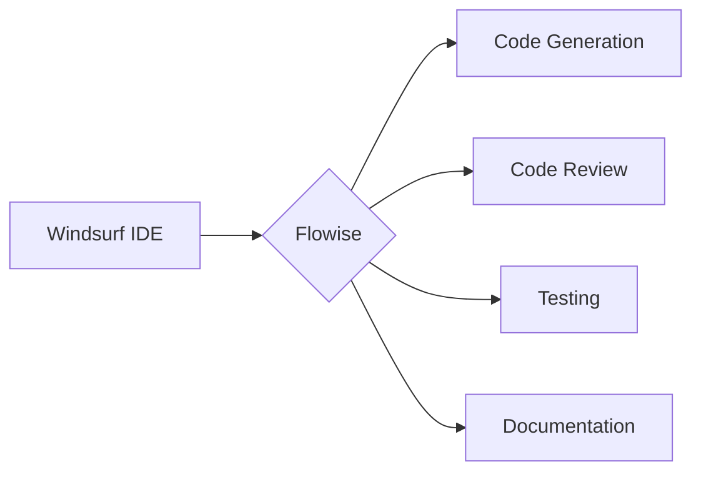

# Flowise Knowledge Base [Main Entry Point]

> Welcome to the Flowise Knowledge Base! This document serves as the main entry point for both human readers and machine processing. For programmatic access, see `metadata/structure.json`.

## Quick Links
1. [Setup Guide](setup/installation.md) - Get Flowise running with Windsurf
2. [Integration Guide](integration/windsurf-flowise.md) - Connect the systems
3. [Workflow Examples](examples/workflows.md) - See it in action

## Core Goals

### 1. Setup Flowise for Windsurf


### 2. Enhanced Development Workflows


### 3. Practical Implementation


## Getting Started

1. **Installation**
   - Follow the [setup guide](setup/installation.md)
   - Verify Flowise is running
   - Configure Windsurf integration

2. **First Steps**
   - Generate a component
   - Run automated tests
   - Review code changes

3. **Advanced Usage**
   - Custom workflows
   - Team collaboration
   - CI/CD integration

## Directory Structure
```
flowise-kb/
├── setup/              # Installation and configuration
├── integration/        # Windsurf-Flowise connection
├── examples/           # Real-world usage examples
├── workflows/          # Common development patterns
└── templates/          # Reusable flow configurations
```

## Need Help?
- Check [Troubleshooting](setup/troubleshooting.md)
- View [Example Workflows](examples/workflows.md)
- Read [Best Practices](integration/best-practices.md)`
