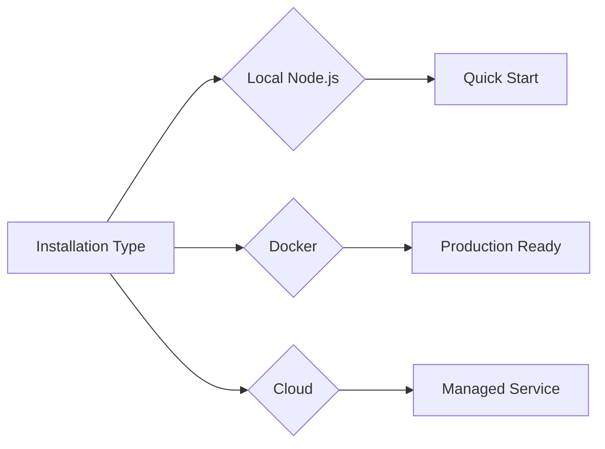

# Flowise Deployment Options

## Installation Methods

| Method | Requirements | Command | Auth Setup |
|--------|--------------|---------|------------|
| Node.js | Node 18+ | `npx flowise start` | ENV variables |
| Docker | Docker | `docker-compose up -d` | Image security |
| Cloud | Subscription | Browser login | OAuth/SAML |
