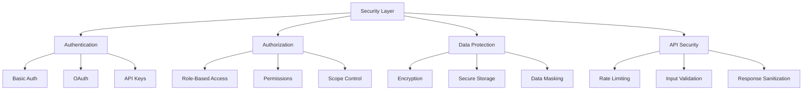

# Security Guide

## Security Architecture



## 1. Authentication Implementation

### Basic Authentication
```typescript
// security/auth.ts
import { hash, compare } from 'bcrypt';

export class AuthenticationService {
    private static readonly SALT_ROUNDS = 10;
    
    static async hashPassword(password: string): Promise<string> {
        return hash(password, this.SALT_ROUNDS);
    }
    
    static async validatePassword(password: string, hash: string): Promise<boolean> {
        return compare(password, hash);
    }
    
    static generateApiKey(): string {
        return crypto.randomBytes(32).toString('hex');
    }
}
```

### OAuth Integration
```typescript
// security/oauth.ts
export class OAuthManager {
    private readonly config: OAuthConfig;
    
    constructor(config: OAuthConfig) {
        this.config = config;
    }
    
    async validateToken(token: string): Promise<boolean> {
        try {
            const response = await fetch(this.config.validationEndpoint, {
                headers: {
                    'Authorization': `Bearer ${token}`
                }
            });
            return response.ok;
        } catch (error) {
            console.error('Token validation failed:', error);
            return false;
        }
    }
}
```

## 2. Data Protection

### Encryption Service
```typescript
// security/encryption.ts
import { createCipheriv, createDecipheriv, randomBytes } from 'crypto';

export class EncryptionService {
    private readonly algorithm = 'aes-256-gcm';
    private readonly key: Buffer;
    
    constructor(key: string) {
        this.key = Buffer.from(key, 'hex');
    }
    
    encrypt(data: string): EncryptedData {
        const iv = randomBytes(16);
        const cipher = createCipheriv(this.algorithm, this.key, iv);
        
        let encrypted = cipher.update(data, 'utf8', 'hex');
        encrypted += cipher.final('hex');
        
        return {
            encrypted,
            iv: iv.toString('hex'),
            tag: cipher.getAuthTag().toString('hex')
        };
    }
    
    decrypt(data: EncryptedData): string {
        const decipher = createDecipheriv(
            this.algorithm,
            this.key,
            Buffer.from(data.iv, 'hex')
        );
        
        decipher.setAuthTag(Buffer.from(data.tag, 'hex'));
        
        let decrypted = decipher.update(data.encrypted, 'hex', 'utf8');
        decrypted += decipher.final('utf8');
        
        return decrypted;
    }
}
```

## 3. API Security

### Rate Limiting
```typescript
// security/rate-limit.ts
export class RateLimiter {
    private readonly store: Map<string, TokenBucket>;
    
    constructor(private readonly config: RateLimitConfig) {
        this.store = new Map();
    }
    
    async checkLimit(key: string): Promise<boolean> {
        const bucket = this.getBucket(key);
        return bucket.tryConsume();
    }
    
    private getBucket(key: string): TokenBucket {
        if (!this.store.has(key)) {
            this.store.set(key, new TokenBucket(this.config));
        }
        return this.store.get(key)!;
    }
}
```

### Input Validation
```typescript
// security/validation.ts
export class InputValidator {
    static validateCode(code: string): ValidationResult {
        const issues: string[] = [];
        
        // Check for dangerous patterns
        const dangerousPatterns = [
            /eval\s*\(/,
            /new\s+Function/,
            /process\.env/
        ];
        
        dangerousPatterns.forEach(pattern => {
            if (pattern.test(code)) {
                issues.push(`Dangerous pattern detected: ${pattern}`);
            }
        });
        
        return {
            valid: issues.length === 0,
            issues
        };
    }
}
```

## 4. Security Best Practices

### 1. Credential Management
```typescript
// security/credentials.ts
export class CredentialManager {
    private static readonly SECURE_VAULT: Map<string, string> = new Map();
    
    static async storeCredential(key: string, value: string): Promise<void> {
        // Encrypt before storing
        const encrypted = await this.encrypt(value);
        this.SECURE_VAULT.set(key, encrypted);
    }
    
    static async getCredential(key: string): Promise<string | null> {
        const encrypted = this.SECURE_VAULT.get(key);
        if (!encrypted) return null;
        
        // Decrypt before returning
        return this.decrypt(encrypted);
    }
    
    private static async encrypt(value: string): Promise<string> {
        // Implementation using EncryptionService
        return value; // Placeholder
    }
    
    private static async decrypt(value: string): Promise<string> {
        // Implementation using EncryptionService
        return value; // Placeholder
    }
}
```

### 2. Secure Configuration
```typescript
// security/config.ts
export class SecureConfig {
    private static instance: SecureConfig;
    private config: Map<string, any> = new Map();
    
    private constructor() {
        this.loadConfig();
    }
    
    static getInstance(): SecureConfig {
        if (!SecureConfig.instance) {
            SecureConfig.instance = new SecureConfig();
        }
        return SecureConfig.instance;
    }
    
    private loadConfig() {
        // Load from secure storage
        const envConfig = process.env;
        
        // Validate and sanitize
        Object.entries(envConfig).forEach(([key, value]) => {
            if (this.isSecureKey(key)) {
                this.config.set(key, this.sanitize(value));
            }
        });
    }
    
    private isSecureKey(key: string): boolean {
        return key.startsWith('SECURE_') || 
               key.includes('KEY') || 
               key.includes('SECRET');
    }
    
    private sanitize(value: string): string {
        // Remove sensitive patterns
        return value.replace(/[^\w\s-]/g, '');
    }
}
```

## 5. Security Monitoring

### Audit Logging
```typescript
// security/audit.ts
export class AuditLogger {
    static log(event: AuditEvent): void {
        const entry = {
            timestamp: new Date().toISOString(),
            event: event.type,
            user: event.user,
            action: event.action,
            resource: event.resource,
            status: event.status,
            metadata: event.metadata
        };
        
        // Log to secure storage
        console.log('AUDIT:', JSON.stringify(entry));
    }
}
```

## 6. Security Checklist

### Development Phase
- [ ] Enable strict TypeScript checks
- [ ] Implement input validation
- [ ] Use parameterized queries
- [ ] Implement rate limiting
- [ ] Set up audit logging

### Deployment Phase
- [ ] Secure all endpoints
- [ ] Configure CORS properly
- [ ] Set up SSL/TLS
- [ ] Configure authentication
- [ ] Enable security headers

### Maintenance Phase
- [ ] Regular security updates
- [ ] Audit log review
- [ ] Credential rotation
- [ ] Performance monitoring
- [ ] Security testing
