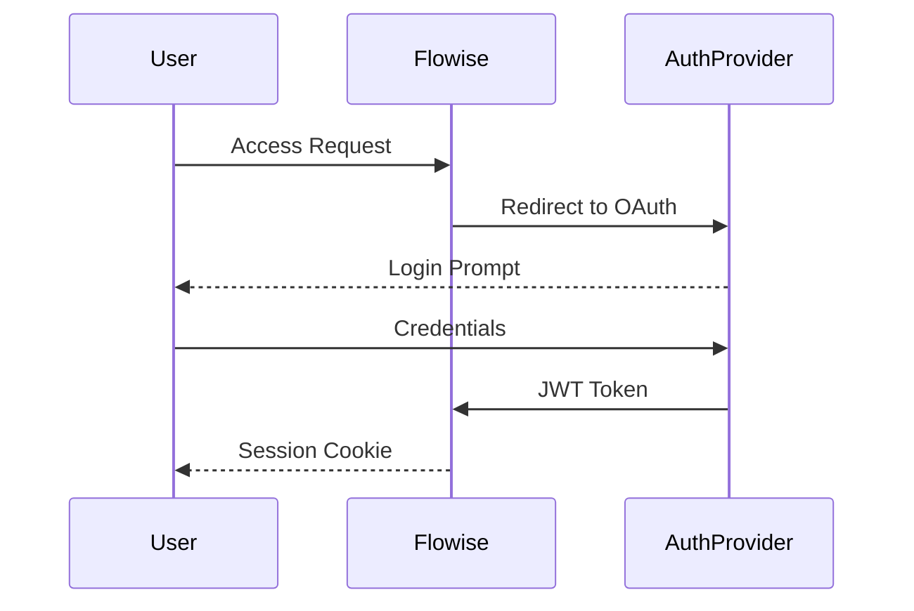

# Flowise Authentication

## Security Architecture


## Authentication Methods
1. **Basic Auth**  
   `npx flowise start --FLOWISE_USERNAME=admin --FLOWISE_PASSWORD=secret`

2. **OAuth 2.0**  
   Configure via environment variables:
   ```bash
   FLOWISE_OAUTH_CLIENT_ID=your_client_id
   FLOWISE_OAUTH_CLIENT_SECRET=your_secret
   ```

3. **API Keys**  
   Manage keys through UI:  
   ```mermaid
   flowchart LR
       A[Admin Dashboard] --> B[Generate Key]
       B --> C[Scopes: read/write/admin]
       C --> D[Store in Vault]
   ```
