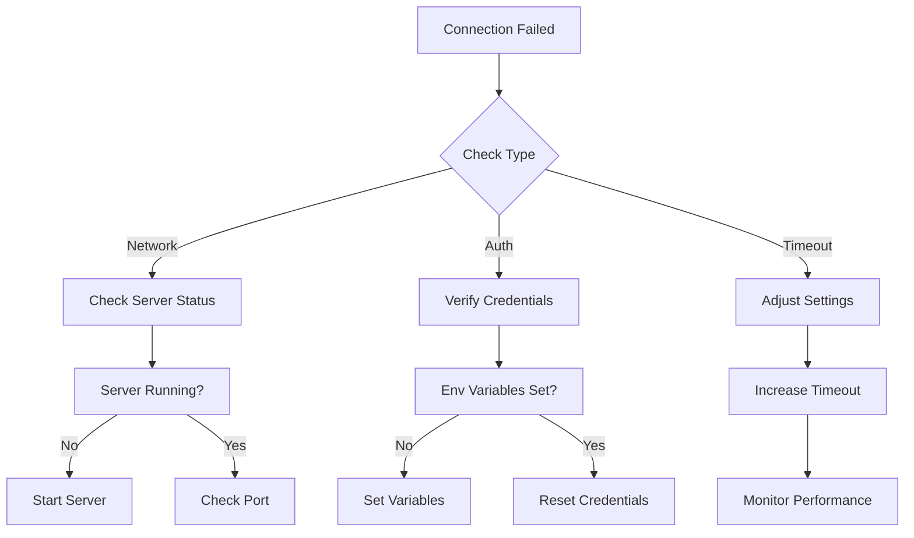
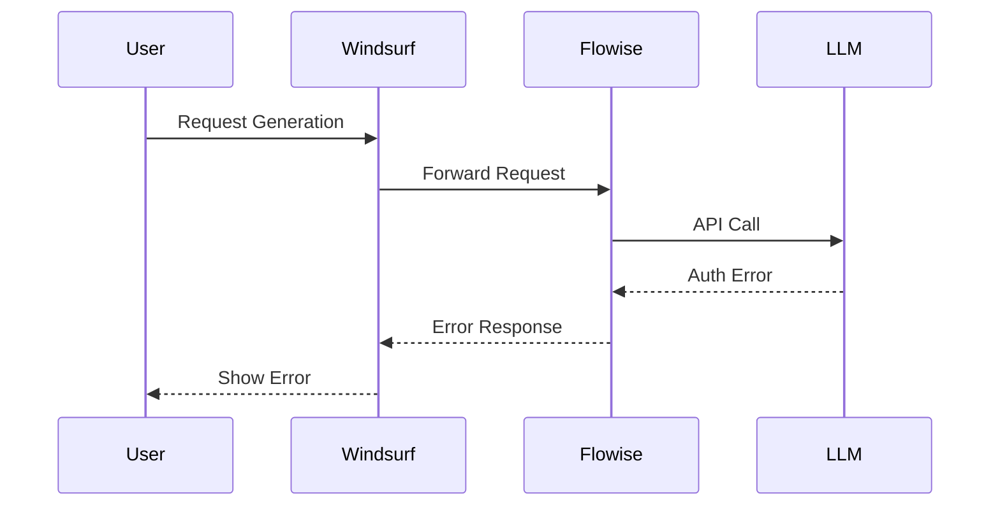
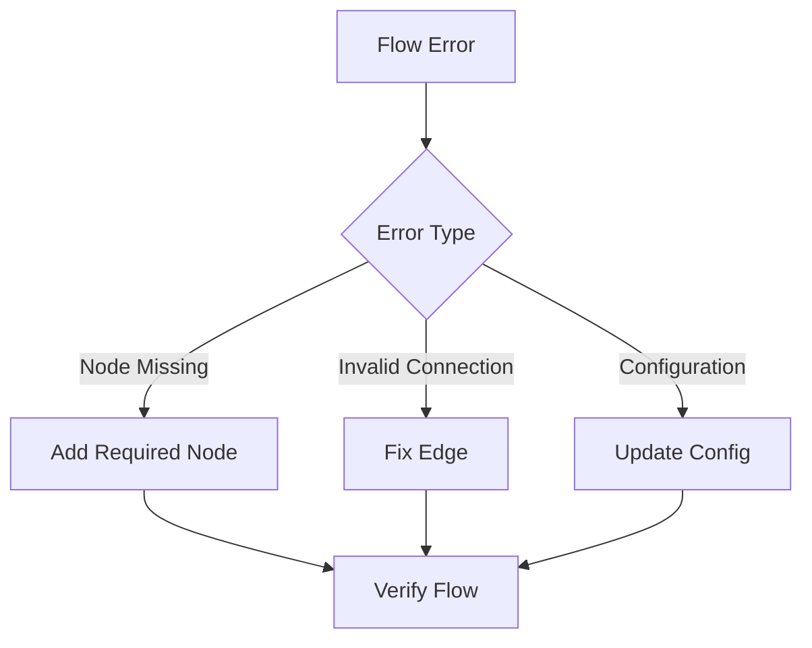
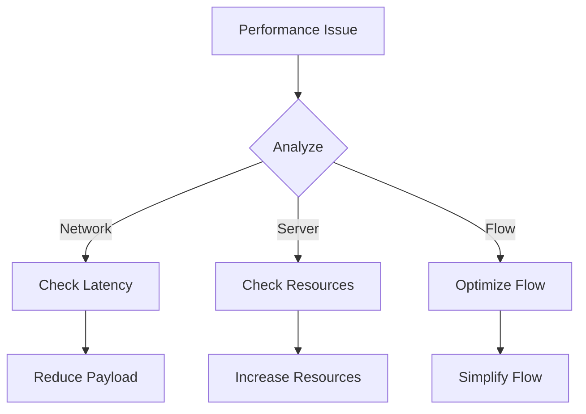

# Troubleshooting Guide

## Common Issues and Solutions

### 1. Connection Issues

#### Flowise Server Connection Failed


**Solutions:**
1. Verify Flowise is running:
   ```bash
   # Check process
   ps aux | grep flowise
   
   # Check port
   lsof -i :3000
   ```

2. Reset credentials:
   ```bash
   # Stop Flowise
   npx flowise stop
   
   # Start with new credentials
   npx flowise start --FLOWISE_USERNAME=new_user --FLOWISE_PASSWORD=new_pass
   ```

### 2. LLM Integration Issues

#### API Key Problems


**Solutions:**
1. Verify API key:
   ```bash
   # Check environment variable
   echo $OPENAI_API_KEY
   
   # Set new key
   export OPENAI_API_KEY="your-key-here"
   ```

2. Test API access:
   ```javascript
   // Test API connection
   async function testLLMConnection() {
       try {
           const response = await fetch('https://api.openai.com/v1/models', {
               headers: {
                   'Authorization': `Bearer ${process.env.OPENAI_API_KEY}`
               }
           });
           return response.ok;
       } catch (error) {
           console.error('LLM Connection failed:', error);
           return false;
       }
   }
   ```

### 3. Flow Execution Problems

#### Flow Validation Errors


**Solutions:**
1. Validate flow configuration:
   ```javascript
   // Flow validation helper
   function validateFlow(flow) {
       const issues = [];
       
       // Check required nodes
       const requiredNodes = ['input', 'llm', 'output'];
       requiredNodes.forEach(node => {
           if (!flow.nodes.some(n => n.type === node)) {
               issues.push(`Missing required node: ${node}`);
           }
       });
       
       // Check connections
       flow.edges.forEach(edge => {
           if (!flow.nodes.find(n => n.id === edge.source) ||
               !flow.nodes.find(n => n.id === edge.target)) {
               issues.push(`Invalid edge: ${edge.source} -> ${edge.target}`);
           }
       });
       
       return issues;
   }
   ```

### 4. Performance Issues

#### Slow Response Times


**Solutions:**
1. Monitor performance:
   ```javascript
   // Performance monitoring
   class PerformanceMonitor {
       static async measureExecution(flowId, operation) {
           const start = performance.now();
           try {
               await operation();
           } finally {
               const duration = performance.now() - start;
               console.log(`Flow ${flowId} execution time: ${duration}ms`);
           }
       }
   }
   ```

2. Optimize flow:
   ```javascript
   // Flow optimization
   function optimizeFlow(flow) {
       return {
           ...flow,
           nodes: flow.nodes.map(node => ({
               ...node,
               data: {
                   ...node.data,
                   caching: true,
                   timeout: 5000
               }
           }))
       };
   }
   ```

### 5. Integration Debugging

#### Debug Mode
```bash
# Enable debug logging
export DEBUG=flowise:*

# Start with debugging
npx flowise start --debug
```

#### Logging Helper
```typescript
// debugging-helper.ts
export class DebugLogger {
    static log(component: string, message: string, data?: any) {
        console.log(`[${component}] ${message}`, data ? JSON.stringify(data, null, 2) : '');
    }
    
    static error(component: string, error: Error) {
        console.error(`[${component}] Error:`, {
            message: error.message,
            stack: error.stack,
            timestamp: new Date().toISOString()
        });
    }
}
```

## Quick Reference

### Status Checks
```bash
# Check Flowise status
curl http://localhost:3000/health

# Check LLM status
curl https://api.openai.com/v1/models \
  -H "Authorization: Bearer $OPENAI_API_KEY"
```

### Common Error Codes
| Code | Meaning | Solution |
|------|----------|----------|
| ECONNREFUSED | Server not running | Start Flowise server |
| 401 | Authentication failed | Check credentials |
| 429 | Rate limit exceeded | Implement rate limiting |
| 503 | Service unavailable | Check server resources |

### Performance Benchmarks
- Flow execution: < 2000ms
- API response: < 500ms
- Memory usage: < 500MB

## Maintenance Tasks

### Regular Checks
1. Update dependencies
   ```bash
   npm update flowise
   ```

2. Clear cache
   ```bash
   # Clear Flowise cache
   rm -rf ~/.flowise/cache
   ```

3. Backup flows
   ```bash
   # Export flows
   curl http://localhost:3000/api/flows/export > flows-backup.json
   ```
