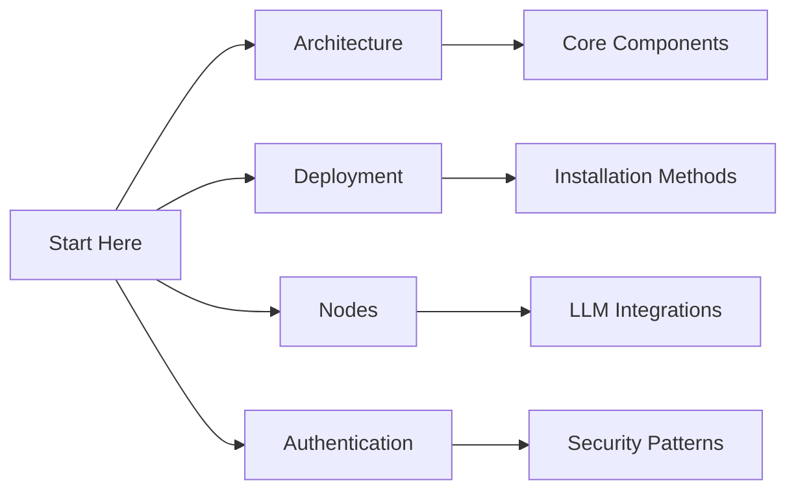

# Shared Knowledge Base Index

> This is the main navigation page for the shared knowledge base. For machine-readable structure, see `metadata/repository.json`.

## Essential Documentation

### 1. Foundation
- [📖 Cognitive Workflow](docs/architecture/cognitive-workflow.md) - Understanding our design philosophy
- [🎯 Architecture Overview](docs/architecture/overview.md) - System architecture and components
- [🔐 Security Guide](docs/security/authentication.md) - Authentication and security patterns

### 2. Implementation
- [🛠 Deployment Guide](docs/guides/deployment.md) - Installation and deployment
- [🧱 Node Reference](docs/api/nodes-reference.md) - API and node documentation
- [🔗 Integration Guide](integrations/windsurf/integration.md) - Windsurf and Flowise integration
4. [Authentication Flows](authentication.md)
