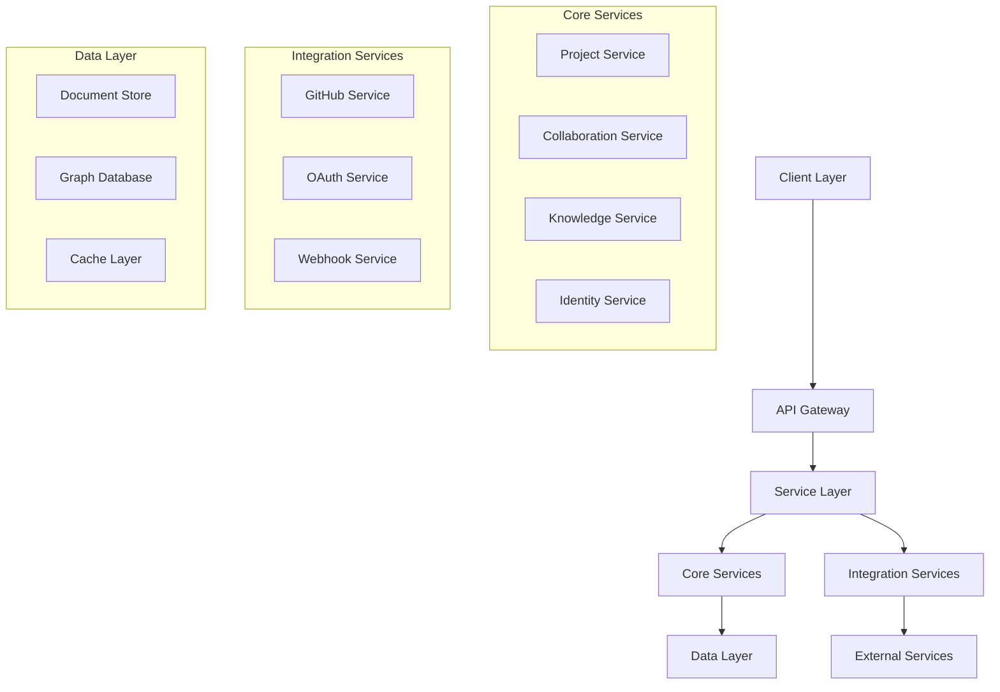

# Huly System Architecture

## Overview

Huly's architecture is designed for scalability, reliability, and seamless collaboration across organizational boundaries.

## System Components



## Component Details

### Client Layer
- Web interface
- Mobile apps
- API clients
- WebSocket connections

### API Gateway
- Request routing
- Load balancing
- Rate limiting
- Authentication

### Core Services

#### Project Service
- Task management
- Workflow engine
- Resource tracking
- Time management

#### Collaboration Service
- Real-time sync
- Video conferencing
- Chat system
- File sharing

#### Knowledge Service
- Document management
- Version control
- Search indexing
- MetaBrain AI

#### Identity Service
- User management
- Authentication
- Authorization
- SSO integration

### Integration Layer
- GitHub sync
- OAuth providers
- Webhook system
- External APIs

### Data Layer
- Document store
- Graph database
- Cache system
- Search index

## Technology Stack

### Frontend
```yaml
UI Framework: React
State Management: Redux
Real-time: WebSocket
Build Tools: Webpack
```

### Backend
```yaml
Runtime: Node.js
Framework: Express
Database: PostgreSQL
Cache: Redis
Search: Elasticsearch
```

### Infrastructure
```yaml
Cloud: AWS/GCP
Container: Docker
Orchestration: Kubernetes
CI/CD: GitHub Actions
```

## Scalability

### Horizontal Scaling
- Stateless services
- Load balancing
- Service discovery
- Auto-scaling

### Data Scaling
- Database sharding
- Read replicas
- Cache layers
- Data partitioning

## Security Architecture

### Network Security
- TLS encryption
- WAF protection
- DDoS mitigation
- Network isolation

### Data Security
- Encryption at rest
- Encryption in transit
- Key management
- Access control

## Monitoring

### System Metrics
- Service health
- Performance stats
- Resource usage
- Error rates

### Business Metrics
- User activity
- Feature usage
- Response times
- Success rates

## Deployment

### Environment Setup
```yaml
Development:
  resources: minimal
  scaling: manual
  monitoring: basic

Staging:
  resources: moderate
  scaling: auto
  monitoring: full

Production:
  resources: optimal
  scaling: auto
  monitoring: advanced
```

### Deployment Process
1. Code review
2. Automated tests
3. Staging deploy
4. Production deploy

## Future Architecture

### Global Huly
- Distributed nodes
- Cross-org routing
- Universal identity
- Resource sharing

### Blockchain Integration
- Smart contracts
- Distributed storage
- Consensus mechanism
- Token economics

## Related Documentation
- [Platform Overview](../platform/overview.md)
- [Security Architecture](../security/overview.md)
- [Deployment Guide](../deployment/guide.md)
