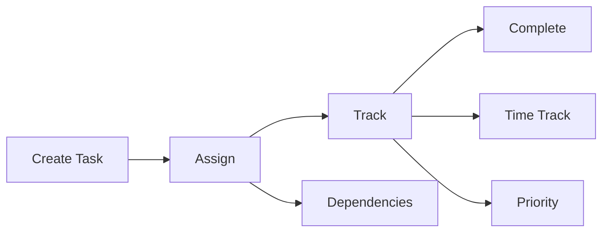

# Project Management in Huly

## Overview

Huly's project management system provides a comprehensive suite of tools for tracking tasks, managing workflows, and coordinating team activities.

## Core Features

### Task Management

#### Task Properties
- Title and description
- Assignees
- Due dates
- Priority levels
- Time estimates
- Dependencies
- Labels/tags
- Attachments

#### Workflow States
- Customizable states
- Automated transitions
- State validation rules
- Progress tracking

### Team Planning

#### Calendar View
- Team-wide calendar
- Resource allocation
- Time blocking
- Event scheduling
- Milestone tracking

#### Resource Management
- Workload visualization
- Capacity planning
- Team availability
- Resource conflicts

## GitHub Integration

### Two-way Synchronization
- Issue sync
- PR tracking
- Commit linking
- Repository management

### Advanced Features
- Multiple repos
- Private tasks
- Milestone sync
- Contribution tracking

## Time Management

### Time Blocking
- Calendar integration
- Focus periods
- Break scheduling
- Productivity tracking

### Time Tracking
- Task-level tracking
- Project summaries
- Team reports
- Billing integration

## Automation

### Workflow Automation
- State transitions
- Notifications
- Task creation
- Assignment rules

### Integration Rules
- GitHub triggers
- External webhooks
- Custom actions
- Scheduled tasks

## Configuration

### Workspace Setup
- Team structure
- Permission levels
- Custom fields
- Workflow states

### Integration Settings
- GitHub connections
- API access
- Webhook config
- SSO setup

## Best Practices

### Project Organization
1. Use consistent naming
2. Define clear workflows
3. Set up automation
4. Track dependencies

### Team Coordination
1. Regular updates
2. Clear assignments
3. Resource planning
4. Progress tracking

## Related Documentation
- [Virtual Office Integration](virtual-office.md)
- [GitHub Setup Guide](../integrations/github.md)
- [API Documentation](../api/reference.md)
- [Configuration Guide](../guides/configuration.md)
