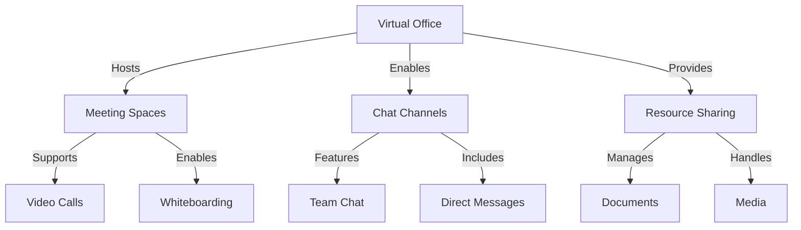

# Virtual Office

## Overview

Huly's Virtual Office creates an immersive digital workspace for remote teams.

## Architecture



## Features

### Meeting Spaces
- Video conferencing
- Screen sharing
- Interactive whiteboarding
- Recording capabilities

### Chat System
- Team channels
- Direct messaging
- File sharing
- Thread discussions

### Resource Management
- Document collaboration
- Media sharing
- Version control
- Access management

## Configuration

```yaml
virtual_office:
  meeting:
    max_participants: 100
    recording_enabled: true
    quality: "HD"
  chat:
    channels_enabled: true
    file_sharing: true
    retention_days: 30
```

## Best Practices

### Meeting Management
1. Schedule in advance
2. Set clear agendas
3. Use breakout rooms
4. Record key sessions

### Communication
1. Use channels effectively
2. Thread discussions
3. Pin important messages
4. Set status updates

## Security

### Access Control
- Role-based access
- Meeting passwords
- Channel permissions
- File restrictions

### Data Protection
- End-to-end encryption
- Secure file transfer
- Audit logging
- Backup systems

## Integration

### With Slack
- Channel sync
- Status sync
- File sharing
- Notifications

### With Calendar
- Meeting scheduling
- Availability sync
- Reminder system
- Resource booking

## Related Documentation
- [Project Management](project-management.md)
- [Slack Integration](../integrations/slack.md)
- [Security Overview](../security/overview.md)
