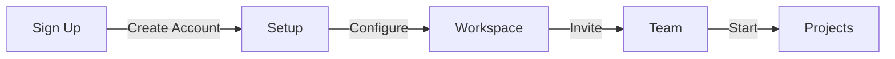

# Getting Started with Huly

## Quick Start



## 1. Account Setup

### Create Account
1. Visit huly.io/signup
2. Enter details
3. Verify email
4. Set preferences

### Initial Configuration
```yaml
workspace:
  name: "Your Workspace"
  timezone: "UTC-6"
  language: "en-US"
```

## 2. Workspace Setup

### Team Configuration
1. Invite members
2. Set roles
3. Configure access
4. Create channels

### Project Setup
1. Create project
2. Add members
3. Set milestones
4. Configure workflow

## 3. Integration Setup

### GitHub Integration
1. Generate token
2. Configure access
3. Select repos
4. Test sync

### Slack Integration
1. Install app
2. Configure channels
3. Set notifications
4. Test connection

## 4. First Steps

### Create Project
1. Name project
2. Set timeline
3. Add tasks
4. Assign team

### Start Collaboration
1. Schedule meeting
2. Share documents
3. Create tasks
4. Begin discussions

## Best Practices

### Organization
1. Use clear naming
2. Set up channels
3. Define workflows
4. Document processes

### Communication
1. Use appropriate channels
2. Keep discussions focused
3. Share updates regularly
4. Document decisions

## Next Steps
- [Configuration Guide](configuration.md)
- [Project Management](../features/project-management.md)
- [Virtual Office](../features/virtual-office.md)
