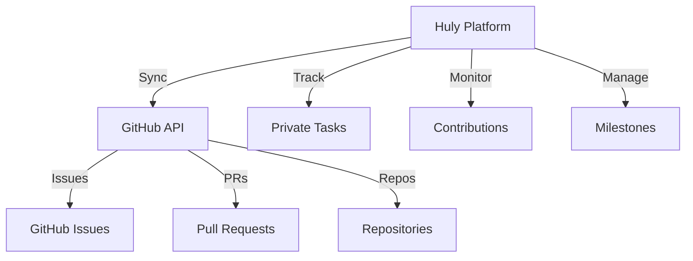

# GitHub Integration Guide

## Overview

Huly provides powerful two-way synchronization with GitHub, enabling seamless integration between project management and code repositories.

## Architecture



## Key Features

### Two-way Synchronization
- Issue creation and updates
- Status synchronization
- Comment mirroring
- Label management
- Milestone tracking

### Multiple Repository Support
- Multi-repo management
- Cross-repo relationships
- Unified view
- Filtered access

### Private Task Management
- Internal-only tasks
- Mixed visibility
- Selective sync
- Access control

### Progress Tracking
- Contribution monitoring
- PR status tracking
- Release management
- Activity analytics

## Setup Guide

### Prerequisites
1. GitHub account
2. Repository access
3. Admin permissions
4. API tokens

### Configuration Steps
1. Generate GitHub token
2. Configure Huly integration
3. Select repositories
4. Set sync options
5. Test connection

## Sync Configuration

### Issue Mapping
```json
{
    "status": {
        "open": "In Progress",
        "closed": "Completed"
    },
    "labels": {
        "bug": "Bug",
        "feature": "Enhancement"
    },
    "priorities": {
        "high": "urgent",
        "medium": "normal"
    }
}
```

### Workflow Rules
- Auto-sync conditions
- Status mapping
- Label conversion
- Priority alignment

## Advanced Features

### Milestone Integration
- Two-way sync
- Progress tracking
- Deadline management
- Resource allocation

### Repository Management
- Multi-repo views
- Access control
- Activity monitoring
- Analytics

### Contribution Tracking
- PR statistics
- Commit tracking
- Review management
- Performance metrics

## Best Practices

### Setup Guidelines
1. Use clear naming
2. Configure filters
3. Set sync rules
4. Test thoroughly

### Workflow Tips
1. Consistent labeling
2. Regular sync checks
3. Clear documentation
4. Team training

## Troubleshooting

### Common Issues
1. Sync failures
2. Permission errors
3. Mapping conflicts
4. Token issues

### Solutions
1. Check permissions
2. Verify tokens
3. Review logs
4. Update config

## Security

### Authentication
- Token management
- Access scopes
- Permission levels
- Audit logging

### Data Protection
- Encrypted sync
- Access control
- Data retention
- Backup systems

## API Reference

### Endpoints
```yaml
/github/sync:
  post:
    description: Trigger sync
    parameters:
      - repo
      - options
/github/status:
  get:
    description: Check sync status
    parameters:
      - syncId
```

### Methods
- Sync triggers
- Status checks
- Config updates
- Data queries

## Related Documentation
- [Project Management](../features/project-management.md)
- [Configuration Guide](../guides/configuration.md)
- [API Documentation](../api/reference.md)
- [Security Overview](../security/overview.md)
