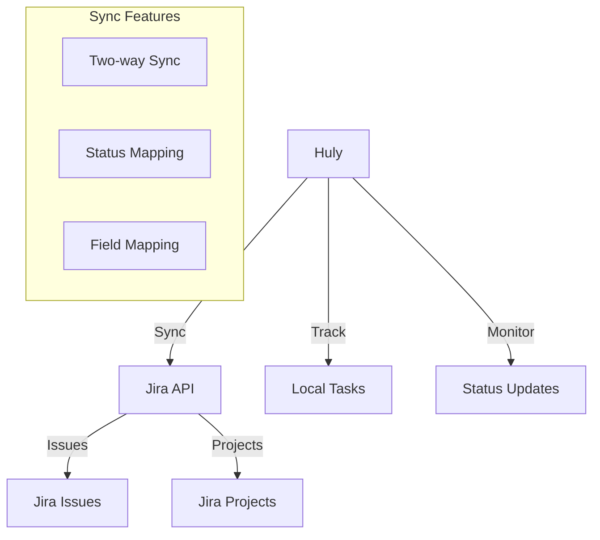

# Jira Integration Guide

## Overview

Huly's Jira integration enables seamless synchronization between Huly tasks and Jira issues.

## Architecture



## Features

### Two-way Synchronization
- Issue creation/updates
- Status changes
- Comment sync
- Attachment handling

### Project Management
- Project mapping
- Sprint integration
- Backlog sync
- Board views

### Field Mapping
```yaml
status:
  "In Progress": "DOING"
  "Completed": "DONE"
  "Blocked": "BLOCKED"

priority:
  "High": "P1"
  "Medium": "P2"
  "Low": "P3"
```

## Setup Guide

### Prerequisites
1. Jira admin access
2. API token
3. Project permissions
4. Huly admin rights

### Configuration Steps
1. Generate API token
2. Configure Huly
3. Map fields
4. Test sync

## Implementation

### API Configuration
```json
{
    "jira": {
        "baseUrl": "https://your-domain.atlassian.net",
        "apiVersion": "3",
        "auth": {
            "type": "basic",
            "email": "your-email",
            "apiToken": "your-token"
        }
    }
}
```

### Webhook Setup
```yaml
endpoints:
  issues: /jira/issues
  projects: /jira/projects
  webhooks: /jira/webhooks
```

## Field Mapping

### Standard Fields
- Summary
- Description
- Assignee
- Priority
- Status

### Custom Fields
```javascript
{
    customFields: {
        "story_points": "customfield_10016",
        "epic_link": "customfield_10014"
    }
}
```

## Best Practices

### Setup Guidelines
1. Plan field mapping
2. Configure filters
3. Test thoroughly
4. Train users

### Workflow Tips
1. Use consistent naming
2. Set up automation
3. Monitor sync
4. Regular audits

## Security

### Authentication
- API tokens
- OAuth 2.0
- Permission scopes
- Access control

### Data Protection
- Encrypted sync
- Audit logging
- Data backup
- Access limits

## Troubleshooting

### Common Issues
1. Sync failures
2. Permission errors
3. Field mapping
4. Webhook issues

### Solutions
1. Check credentials
2. Verify permissions
3. Update mapping
4. Check logs

## API Reference

### Endpoints
```yaml
/api/v1/jira/sync:
  post:
    description: Sync issues
/api/v1/jira/webhook:
  post:
    description: Handle webhooks
```

### Methods
- Issue sync
- Project sync
- Status updates
- Field mapping

## Migration Guide

### From Jira to Huly
1. Export data
2. Map fields
3. Import tasks
4. Verify sync

### Maintaining Both Systems
1. Set up sync
2. Configure webhooks
3. Test integration
4. Monitor performance

## Related Documentation
- [Project Management](../features/project-management.md)
- [Task Tracking](../features/task-tracking.md)
- [API Reference](../api/reference.md)
