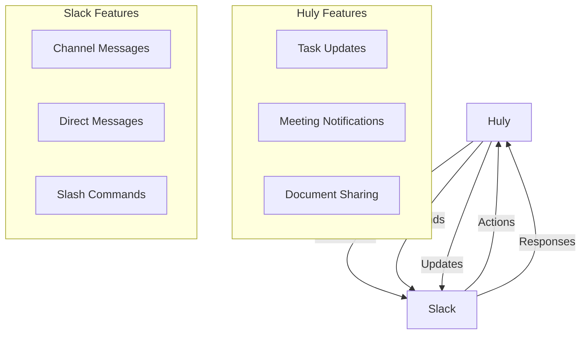

# Slack Integration Guide

## Overview

Huly's Slack integration enables seamless communication between Huly and Slack workspaces.

## Features



## Setup Process

### Prerequisites
1. Slack workspace admin access
2. Huly admin permissions
3. Slack app creation rights

### Configuration Steps
1. Create Slack app
2. Set permissions
3. Install to workspace
4. Configure Huly

## Integration Features

### Notifications
- Task updates
- Meeting reminders
- Document changes
- Mention alerts

### Commands
```yaml
/huly task:
  description: Create/view tasks
  usage: /huly task create "Task name"

/huly meet:
  description: Schedule meetings
  usage: /huly meet schedule "Meeting title"

/huly doc:
  description: Share documents
  usage: /huly doc share "Document name"
```

### Actions
- Task response
- Meeting RSVP
- Document access
- Quick replies

## Configuration

### Slack App Settings
```json
{
    "app": {
        "name": "Huly Integration",
        "description": "Huly workspace integration",
        "permissions": [
            "chat:write",
            "commands",
            "users:read"
        ]
    }
}
```

### Webhook Configuration
```yaml
endpoints:
  events: /slack/events
  commands: /slack/commands
  actions: /slack/actions
```

## Best Practices

### Setup Guidelines
1. Use clear naming
2. Set notification preferences
3. Configure channels
4. Test thoroughly

### Usage Tips
1. Organize channels
2. Set up filters
3. Train users
4. Monitor activity

## Security

### Authentication
- OAuth 2.0
- Token management
- Scope control
- User verification

### Data Protection
- Encrypted communication
- Access control
- Audit logging
- Data retention

## Troubleshooting

### Common Issues
1. Connection problems
2. Permission errors
3. Message failures
4. Command issues

### Solutions
1. Check tokens
2. Verify permissions
3. Update settings
4. Review logs

## API Reference

### Endpoints
```yaml
/api/v1/slack/webhook:
  post:
    description: Receive Slack events
/api/v1/slack/command:
  post:
    description: Handle Slack commands
```

### Methods
- Event handling
- Command processing
- Message sending
- Action responses

## Related Documentation
- [Virtual Office](../features/virtual-office.md)
- [Notifications](../features/notifications.md)
- [Security Overview](../security/overview.md)
