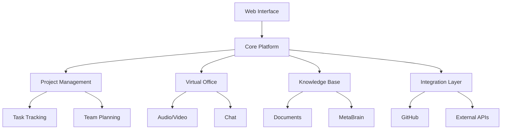

# Huly Platform Overview

## System Architecture

## Core Components

### 1. Project Management Engine
- Task tracking and workflow automation
- Team calendar and resource planning
- Time blocking and productivity tools
- Advanced filtering and organization

### 2. Real-time Collaboration Suite
- Virtual office spaces with audio/video
- Team chat and messaging
- Guest access management
- Real-time notifications

### 3. Knowledge Management System
- Document collaboration
- Version control
- Rich text editing
- File attachments
- MetaBrain integration

### 4. Integration Framework
- GitHub two-way sync
- API endpoints
- External service connectors
- Data import/export

## Key Features

### Workflow Management
- Customizable workspaces
- Keyboard shortcuts
- Task dependencies
- Progress tracking
- Time management

### Team Collaboration
- Virtual meetings
- Document co-editing
- Chat channels
- Guest collaboration
- File sharing

### Knowledge Base
- Rich text documents
- Code snippets
- Image embedding
- Search functionality
- Version history

## Security & Compliance

### Authentication
- User identity management
- Role-based access control
- Single sign-on options
- Guest access controls

### Data Protection
- End-to-end encryption (planned)
- Data backup
- Audit logging
- Privacy controls

## Future Roadmap

### Global Huly
- Cross-organization collaboration
- Permanent user identities
- Fluid workspaces
- Universal access

### Blockchain Integration
- Decentralized infrastructure
- Community ownership
- Enhanced security
- Trustless collaboration

## Related Resources
- [Architecture Deep Dive](../architecture/system.md)
- [Feature Documentation](../features/project-management.md)
- [Security Overview](../security/overview.md)
- [API Reference](../api/reference.md)
