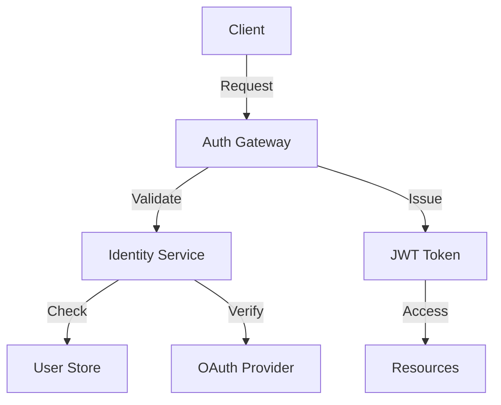

# Authentication in Huly

## Overview

Huly provides a robust, multi-layered authentication system supporting various authentication methods and identity providers.

## Architecture



## Authentication Methods

### OAuth 2.0
- Standard OAuth flow
- Multiple providers
- Scope management
- Token refresh

### SSO Integration
- SAML 2.0 support
- Identity federation
- Role mapping
- Session management

### API Keys
- Scoped access
- Key rotation
- Usage tracking
- Rate limiting

## Implementation Guide

### OAuth Setup
```javascript
const config = {
    providers: {
        github: {
            clientId: "YOUR_CLIENT_ID",
            clientSecret: "YOUR_CLIENT_SECRET",
            scopes: ["user", "repo"]
        }
    }
};
```

### Token Management
```javascript
// Token structure
{
    "iss": "huly.io",
    "sub": "user123",
    "aud": "api.huly.io",
    "exp": 1613487600,
    "scopes": ["read", "write"]
}
```

## Security Considerations

### Token Security
1. Short expiration
2. Secure storage
3. HTTPS only
4. Token rotation

### Access Control
1. Role-based access
2. Resource scoping
3. Permission checks
4. Audit logging

## Best Practices

### Implementation
1. Use secure protocols
2. Implement rate limiting
3. Enable MFA
4. Regular audits

### User Management
1. Password policies
2. Account recovery
3. Session control
4. Activity monitoring

## Future Enhancements

### Global Huly Auth
- Blockchain identity
- Cross-org authentication
- Decentralized trust
- Universal access

### Enhanced Security
- Biometric auth
- Hardware keys
- Zero-trust model
- AI monitoring

## API Reference

### Authentication Endpoints
```yaml
/auth/login:
  post:
    description: User login
/auth/token:
  post:
    description: Token refresh
/auth/revoke:
  post:
    description: Token revocation
```

## Related Documentation
- [Security Overview](overview.md)
- [API Reference](../api/reference.md)
- [OAuth Guide](../guides/oauth-setup.md)
