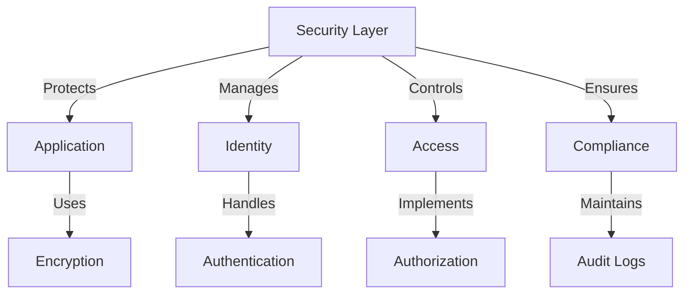

# Security Overview

## Architecture

## Core Components

### Authentication
- Multi-factor authentication
- SSO integration
- Biometric support
- Session management

### Authorization
- Role-based access
- Resource permissions
- Scope control
- Token validation

### Data Protection
- End-to-end encryption
- At-rest encryption
- Secure transport
- Key management

## Security Measures

### Network Security
- TLS 1.3
- WAF protection
- DDoS mitigation
- Network isolation

### Application Security
- Input validation
- Output encoding
- CSRF protection
- XSS prevention

### Infrastructure Security
- Container isolation
- Resource limits
- Secure defaults
- Regular updates

## Compliance

### Standards
- SOC 2
- GDPR
- HIPAA
- ISO 27001

### Policies
- Data retention
- Access control
- Incident response
- Business continuity

## Best Practices

### Development
1. Secure coding
2. Code review
3. Dependency scanning
4. Security testing

### Operations
1. Access management
2. Monitoring
3. Incident response
4. Regular audits

## Related Documentation
- [Authentication Guide](authentication.md)
- [System Architecture](../architecture/system.md)
- [Deployment Guide](../deployment/guide.md)
