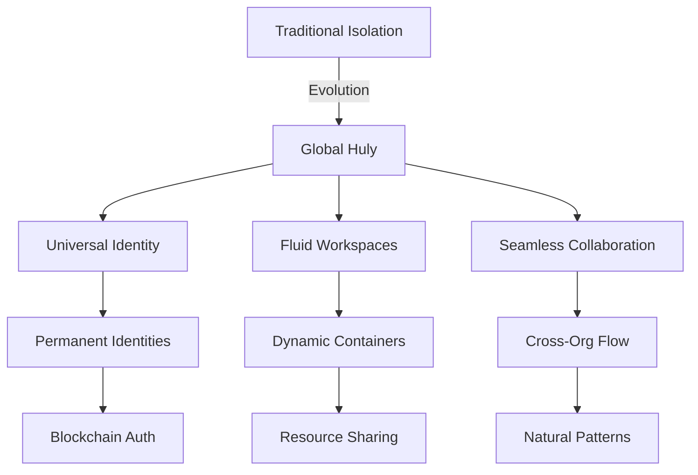
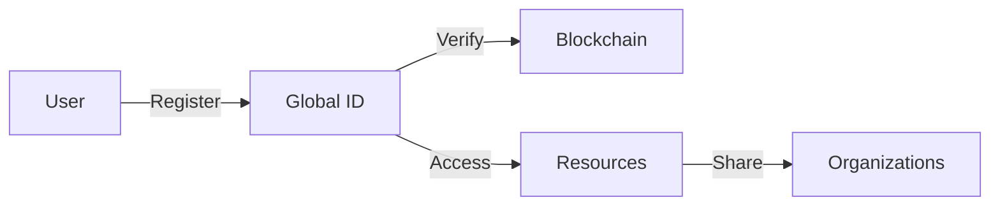

# Global Huly: Breaking Down Organizational Barriers

## Vision Overview

## Current Limitations

### Organizational Silos
- Isolated workspaces
- Limited external collaboration
- Redundant tooling
- Communication barriers

### Traditional Architecture
- Multi-tenant isolation
- Security through separation
- Limited cross-org features
- Complex integration needs

## The Global Huly Solution

### Universal Identity
- Permanent user identities
- Cross-organization profiles
- Reputation systems
- Skill verification

### Fluid Workspaces
- Dynamic collaboration spaces
- Resource sharing
- Project-based organization
- Flexible boundaries

### Natural Collaboration
- Seamless external access
- Real-time cooperation
- Resource optimization
- Knowledge sharing

## Implementation Roadmap

### Phase 1: Foundation
1. Universal identity system
2. Cross-workspace access
3. Shared resource pools
4. Initial integration framework

### Phase 2: Enhancement
1. Advanced permissions
2. Resource optimization
3. Collaboration tools
4. Analytics and insights

### Phase 3: Optimization
1. AI-powered matching
2. Automated workflows
3. Smart resource allocation
4. Performance optimization

## Technical Architecture

### Identity Management

### Resource Sharing
- Cross-org file access
- Shared knowledge bases
- Combined task tracking
- Unified communications

### Security Model
- Zero-trust architecture
- End-to-end encryption
- Granular permissions
- Audit logging

## Benefits

### For Organizations
- Reduced tool overhead
- Improved collaboration
- Better resource utilization
- Enhanced security

### For Users
- Single identity
- Seamless access
- Enhanced productivity
- Career continuity

### For Projects
- Faster team assembly
- Better resource access
- Improved coordination
- Knowledge retention

## Future Integration

### Blockchain Evolution
- Decentralized storage
- Smart contracts
- Token economics
- Community governance

### AI Enhancement
- Resource matching
- Workflow optimization
- Knowledge synthesis
- Predictive analytics

## Getting Started

### For Organizations
1. Identity system setup
2. Resource sharing config
3. Integration planning
4. Team training

### For Users
1. Global ID creation
2. Profile setup
3. Workspace connection
4. Collaboration start

## Resources
- [Blockchain Vision](blockchain.md)
- [Security Overview](../security/overview.md)
- [Technical Architecture](../architecture/system.md)
- [Integration Guide](../guides/integration.md)
