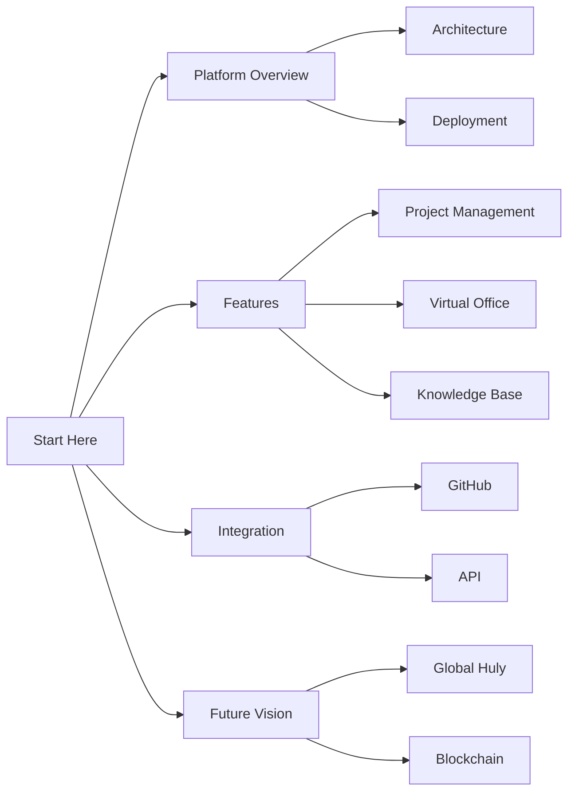

# Huly Knowledge Base Index

> This is the main navigation page for the Huly knowledge base. For machine-readable structure, see `metadata/repository.json`.

## Essential Documentation

### 1. Platform Foundation
- [📖 Platform Overview](docs/platform/overview.md) - Understanding Huly's core concepts
- [🎯 Architecture Guide](docs/architecture/system.md) - System architecture and components
- [🔐 Security Overview](docs/security/overview.md) - Security model and best practices
- [🔒 Authentication](docs/security/authentication.md) - Authentication system details

### 2. Core Features
- [📋 Project Management](docs/features/project-management.md) - Task tracking and workflow
- [🏢 Virtual Office](docs/features/virtual-office.md) - Real-time collaboration

### 3. Integration & Development
- [🔗 GitHub Integration](docs/integrations/github.md) - Two-way sync with GitHub
- [💬 Slack Integration](docs/integrations/slack.md) - Team communication
- [📊 Jira Integration](docs/integrations/jira.md) - Project management
- [🛠 Script Integration](docs/guides/script-integration.md) - Using kb-network scripts

### 4. Future Vision
- [🌐 Global Huly](docs/vision/global-huly.md) - Cross-organization collaboration

## Quick Links
- [Getting Started Guide](docs/guides/getting-started.md)
- [Contributing Guidelines](CONTRIBUTING.md)
- [Templates](templates/)
- [Metadata Schemas](metadata/schemas/)
