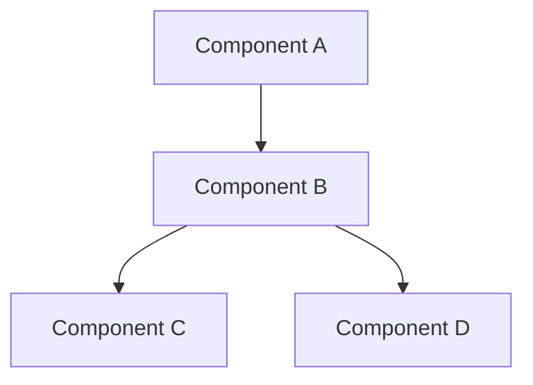

# Feature: {{FEATURE_NAME}}

## Overview

Brief description of the feature and its purpose.

## Architecture



## Components

### Component A
- Purpose
- Functionality
- Configuration options

### Component B
- Purpose
- Functionality
- Configuration options

## Configuration

```yaml
feature:
  enabled: true
  options:
    setting1: value1
    setting2: value2
```

## Usage Examples

### Basic Usage

```javascript
// Code example
```

### Advanced Usage

```javascript
// Advanced code example
```

## Best Practices

1. Recommendation 1
   - Details
   - Examples
2. Recommendation 2
   - Details
   - Examples

## Troubleshooting

### Common Issues

1. Issue 1
   - Symptoms
   - Solution
2. Issue 2
   - Symptoms
   - Solution

## Performance Considerations

- Optimization tips
- Resource usage
- Scaling considerations

## Security Notes

- Authentication requirements
- Permission levels
- Data protection

## Related Features
- [Feature 1](feature1.md)
- [Feature 2](feature2.md)
- [Feature 3](feature3.md)
