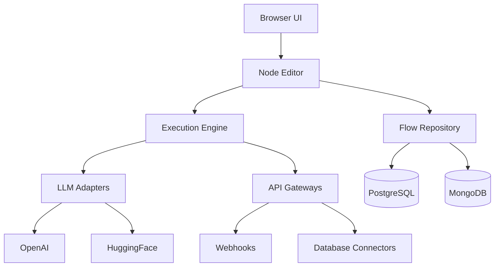

# Flowise Core Architecture

## System Components

## Key Concepts
- **Nodes**: Modular components with typed inputs/outputs
- **Flows**: Directed acyclic graphs of connected nodes
- **Templates**: Reusable flow configurations
- **Triggers**: HTTP/webhook/scheduled starters
