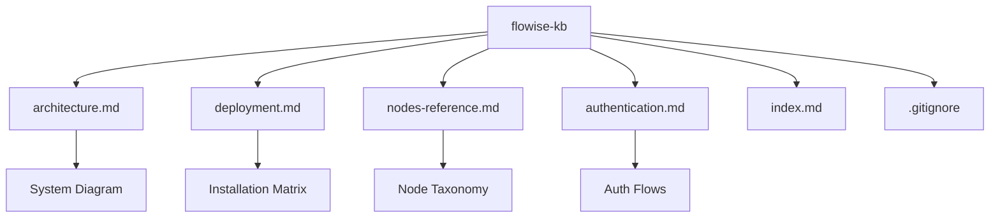

# Knowledge Base Structure

```mermaid
graph TD
    A[flowise-kb] --> B[architecture.md]
    A --> C[deployment.md]
    A --> D[nodes-reference.md]
    A --> E[authentication.md]
    A --> F[index.md]
    A --> G[.gitignore]
    B --> H[System Diagram]
    C --> I[Installation Matrix]
    D --> J[Node Taxonomy]
    E --> K[Auth Flows]
```
