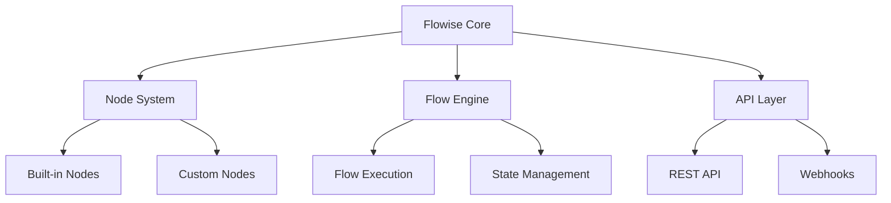

# Flowise Core Concepts

---
type: concept
version: 1.0
tags: [core, architecture, fundamentals]
relationships: [architecture.md, workflows.md]
---

## Component Architecture



## AI Integration Points

1. **Code Generation**
   ```json
   {
     "type": "node",
     "category": "code-generation",
     "capabilities": [
       "component-creation",
       "test-generation",
       "documentation"
     ]
   }
   ```

2. **Code Analysis**
   ```json
   {
     "type": "node",
     "category": "code-analysis",
     "capabilities": [
       "linting",
       "security-scan",
       "dependency-check"
     ]
   }
   ```

## Query Examples for AI Agents

```json
{
  "query_types": {
    "implementation": "How do I implement X?",
    "explanation": "What does X do?",
    "troubleshooting": "Why isn't X working?",
    "best_practices": "What's the best way to X?"
  }
}
```
