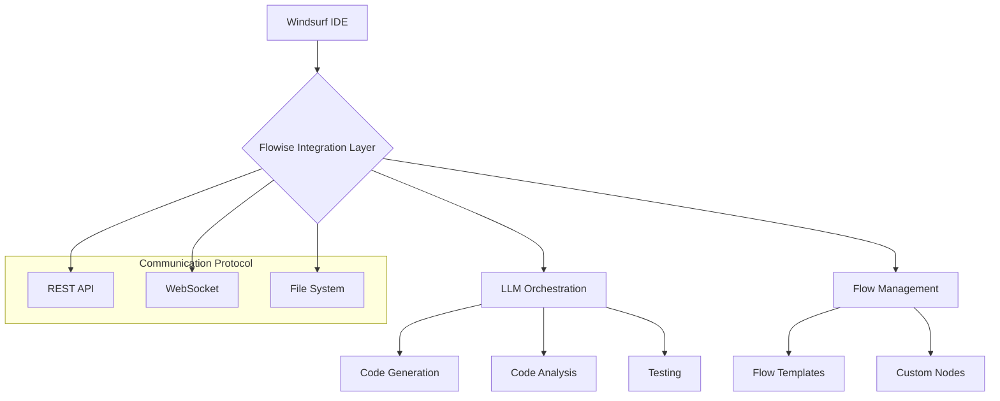

# Windsurf-Flowise Integration

---
type: integration
version: 1.0
tags: [windsurf, ide, integration]
last_updated: 2025-02-15
status: draft
---

## Integration Architecture



## Proposed Integration Methods

### 1. Direct API Integration
```json
{
  "integration_type": "api",
  "endpoints": {
    "code_generation": "/api/generate",
    "code_analysis": "/api/analyze",
    "flow_execution": "/api/execute"
  },
  "authentication": {
    "type": "bearer",
    "token_management": "env_variable"
  }
}
```

### 2. Flow Templates for IDE Tasks
```json
{
  "templates": {
    "code_generation": {
      "input": "natural_language",
      "nodes": [
        "prompt_parser",
        "code_generator",
        "syntax_validator"
      ],
      "output": "validated_code"
    },
    "code_review": {
      "input": "git_diff",
      "nodes": [
        "diff_analyzer",
        "style_checker",
        "security_scanner"
      ],
      "output": "review_comments"
    }
  }
}
```

## Implementation Steps (TODO)

1. **Setup Connection**
   ```mermaid
   sequenceDiagram
       Windsurf->>Flowise: Initialize Connection
       Flowise->>Windsurf: Connection Established
       Windsurf->>Flowise: Register Templates
       Flowise->>Windsurf: Templates Loaded
   ```

2. **Code Generation Flow**
   ```mermaid
   sequenceDiagram
       Windsurf->>Flowise: Send Code Request
       Flowise->>LLM: Generate Code
       LLM->>Flowise: Return Code
       Flowise->>Validator: Validate
       Validator->>Windsurf: Insert Code
   ```

## Required Development

### Windsurf Side
1. Implement Flowise API client
2. Create template management system
3. Add flow execution handlers
4. Implement response processors

### Flowise Side
1. Create custom IDE-specific nodes
2. Implement WebSocket support
3. Add file system watchers
4. Create IDE-specific flow templates

## Security Considerations
```json
{
  "security_requirements": {
    "authentication": "required",
    "encryption": "in_transit",
    "permissions": [
      "file_system",
      "code_execution",
      "network_calls"
    ]
  }
}
```

## Next Steps
1. Implement basic API integration
2. Create proof-of-concept flow templates
3. Test communication protocol
4. Document API specifications
5. Create example workflows

## Open Questions
- Best method for real-time code updates
- Flow template versioning strategy
- Error handling protocols
- Performance optimization strategies

Note: This integration is currently in planning phase. Implementation details need to be validated and tested.
