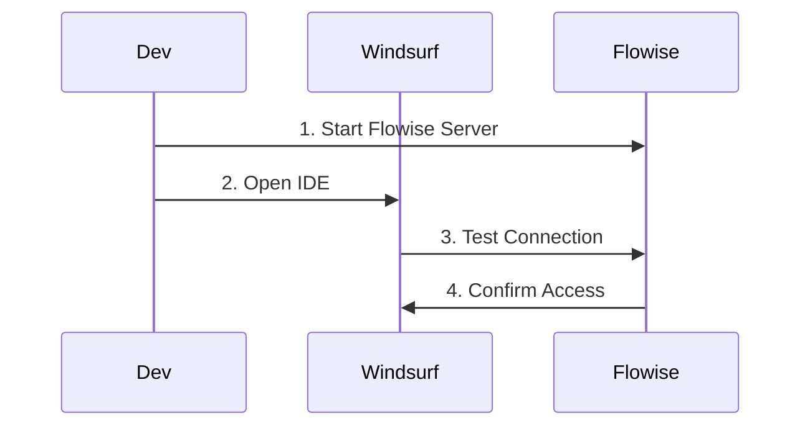

# Setting Up Flowise with Windsurf

## Prerequisites
- Node.js >= 18.15.0
- Windsurf IDE installed
- API key for your preferred LLM (e.g., OpenAI)

## Installation Steps

### 1. Install Flowise
```bash
# Install Flowise globally
npm install -g flowise

# Start Flowise with authentication
npx flowise start --FLOWISE_USERNAME=your_username --FLOWISE_PASSWORD=your_password
```

### 2. Configure Windsurf Integration


### 3. Environment Setup
```bash
# Required environment variables
FLOWISE_USERNAME=your_username
FLOWISE_PASSWORD=your_password
OPENAI_API_KEY=your_openai_key
FLOWISE_PORT=3000
```

## Verification Steps

1. **Check Flowise Installation**
   ```bash
   # Verify Flowise is running
   curl http://localhost:3000/health
   ```

2. **Test Windsurf Connection**
   - Open Windsurf IDE
   - Access command palette
   - Run "Test Flowise Connection"

3. **Verify LLM Access**
   ```mermaid
   graph TD
       A[Create Test Flow] --> B[Add LLM Node]
       B --> C[Configure API Key]
       C --> D[Test Connection]
   ```

## Common Setup Tasks

### 1. Create Basic Code Generation Flow
```json
{
  "nodes": [
    {
      "type": "promptTemplate",
      "data": {
        "template": "Generate a React component that {{functionality}}"
      }
    },
    {
      "type": "llmNode",
      "data": {
        "model": "gpt-4"
      }
    },
    {
      "type": "codeFormatter",
      "data": {
        "language": "typescript"
      }
    }
  ]
}
```

### 2. Configure IDE Integration
```json
{
  "settings": {
    "flowise": {
      "endpoint": "http://localhost:3000",
      "auth": {
        "type": "basic",
        "username": "${FLOWISE_USERNAME}",
        "password": "${FLOWISE_PASSWORD}"
      }
    }
  }
}
```

## Troubleshooting

### Common Issues
1. **Connection Failed**
   - Verify Flowise is running
   - Check port configuration
   - Validate credentials

2. **LLM Integration Issues**
   - Verify API key
   - Check node configuration
   - Review error logs

3. **IDE Integration**
   - Restart Windsurf
   - Check connection settings
   - Verify environment variables

## Next Steps
1. [Create your first workflow](../examples/workflows.md)
2. [Configure custom templates](../templates/custom-templates.md)
3. [Set up team sharing](../integration/team-setup.md)

## Security Notes
- Store credentials securely
- Use environment variables
- Implement proper access controls
- Regular security updates
