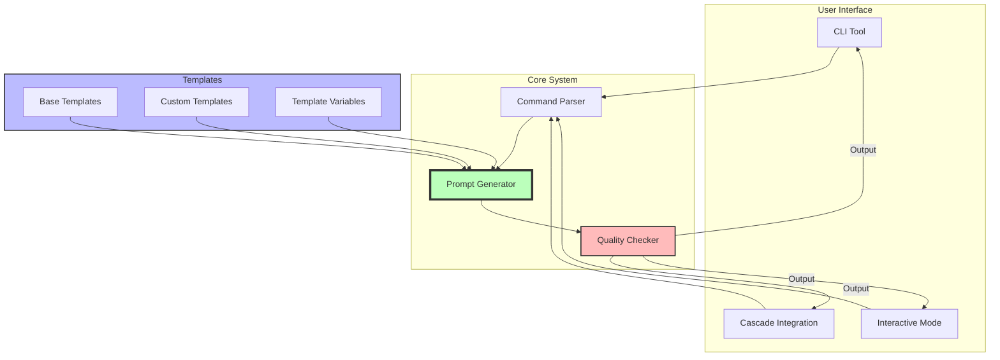
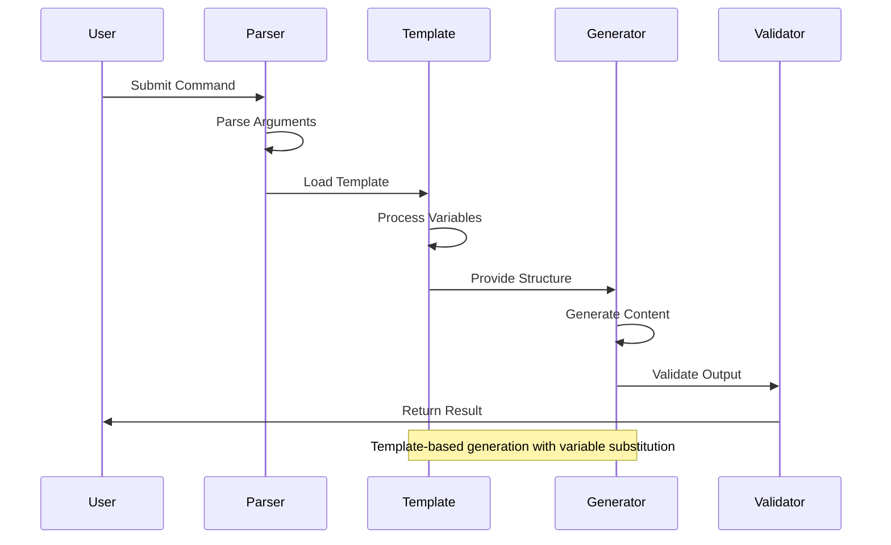
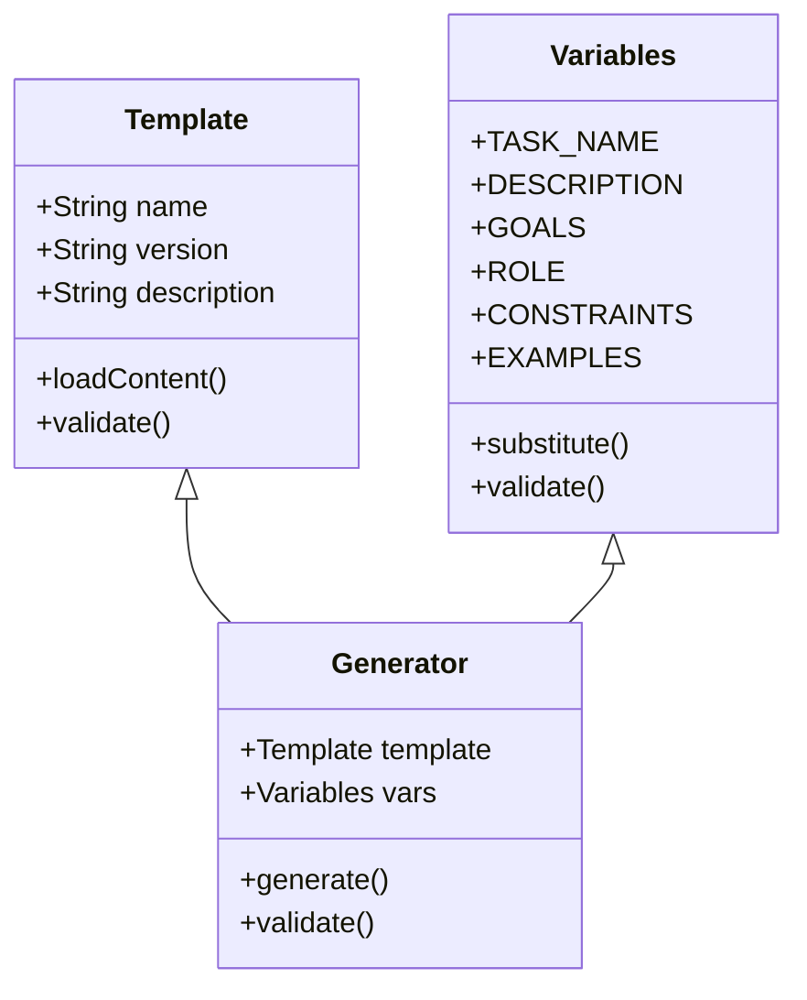
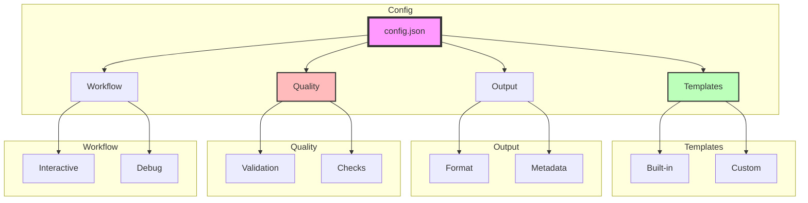

# Prompt Generator

A powerful system for generating structured, high-quality prompts for AI interactions. This tool helps maintain consistency and effectiveness in AI communications while following best practices for prompt engineering.

## System Overview



## Template Processing



## Why Use Prompt Generator?

- **Consistency**: Standardized templates ensure consistent AI interactions
- **Quality**: Built-in checks and validations for prompt effectiveness
- **Efficiency**: Quick generation of complex prompts
- **Best Practices**: Incorporates proven prompt engineering patterns
- **Flexibility**: Customizable templates for different use cases

## Quick Start

### 1. Direct with Cascade
```bash
# Basic command format
/prompt [task] [requirement1] [requirement2] ...

# Examples
/prompt create API docs include-endpoints show-examples
/prompt code review security-focus performance-check
/prompt technical docs include-diagrams add-examples
```

### 2. Shell Script
```bash
# Make script executable
chmod +x scripts/prompt-gen.sh

# Add alias (optional)
echo 'alias pg="~/knowledge-bases/kb-nahum-jeff-shared/scripts/prompt-gen.sh"' >> ~/.zshrc

# Use the script
./prompt-gen.sh "Create API docs" "Include endpoints" "Show examples"

# Or with alias
pg "Create API docs" "Include endpoints" "Show examples"
```

### 3. Template Selection
```bash
# Specify template
/prompt --template api_docs create endpoint documentation

# Use custom template
/prompt --template custom.xml generate documentation
```

## Installation

1. Make the script executable:
```bash
chmod +x scripts/prompt-gen.sh
```

2. Add alias to your shell config (~/.zshrc or ~/.bashrc):
```bash
alias pg='~/knowledge-bases/kb-nahum-jeff-shared/scripts/prompt-gen.sh'
```

## Features

- Structured prompt generation
- Template-based output
- Support for multiple requirements
- Built-in quality checks

## Template System

### Built-in Templates

Located in `templates/` directory:

1. **General Purpose** (`general.xml`)
   - Base template for most tasks
   - Customizable structure
   - Chain of thought support

2. **API Documentation** (`api_docs.xml`)
   - Endpoint documentation
   - Request/response formats
   - Authentication details
   - Error handling

3. **Code Review** (`code_review.xml`)
   - Security analysis
   - Performance review
   - Best practices check
   - Improvement suggestions

4. **Technical Documentation** (`technical_docs.xml`)
   - System architecture
   - Component interactions
   - Setup instructions
   - Troubleshooting guides

5. **Chain of Thought** (`chain_of_thought.xml`)
   - Explicit reasoning steps
   - Verification points
   - Solution validation
   - Alternative approaches

### Custom Templates

Create your own in XML format:

```xml
<prompt_template>
    <task_definition>
        <name>{$TASK_NAME}</name>
        <description>{$DESCRIPTION}</description>
        <goals>{$GOALS}</goals>
    </task_definition>
    
    <system_prompt>
        [Your system prompt structure]
    </system_prompt>
    
    <chain_of_thought>
        [Reasoning steps]
    </chain_of_thought>
    
    <quality_checks>
        [Validation criteria]
    </quality_checks>
</prompt_template>
```

### Template System



### Template Variables

Common variables you can use:
- `{$TASK_NAME}` - Name of the task
- `{$DESCRIPTION}` - Task description
- `{$GOALS}` - Task goals
- `{$ROLE}` - AI's role
- `{$CONSTRAINTS}` - Task constraints
- `{$EXAMPLES}` - Example inputs/outputs

## Advanced Usage

### Command Options
```bash
# Specify output format
/prompt --format json create API docs

# Use multiple requirements
/prompt create docs --req "Include diagrams" --req "Add examples" --req "Show setup"

# Chain commands
/prompt create docs --chain "design" "implement" "test"

# Custom quality checks
/prompt review code --checks "security" "performance" "style"
```

### Template Customization
```bash
# Use custom variables
/prompt --var ROLE="Security Analyst" --var FOCUS="Authentication" review code

# Combine templates
/prompt --template "security.xml,performance.xml" review system

# Override quality checks
/prompt --checks "custom_checks.json" review code
```

### Integration with Cascade

1. **Direct Usage**
   ```bash
   /prompt [task] [requirements...]
   ```

2. **Interactive Mode**
   ```bash
   /prompt --interactive create docs
   # Cascade will guide you through options
   ```

3. **Template Preview**
   ```bash
   /prompt --preview api_docs
   # Shows template without generating
   ```

4. **Quality Assurance**
   ```bash
   /prompt --validate my_template.xml
   # Validates custom template
   ```

## Troubleshooting

### Common Issues

1. **Template Not Found**
   ```bash
   # Check template path
   /prompt --list-templates
   # Shows available templates
   ```

2. **Variable Errors**
   ```bash
   # List available variables
   /prompt --list-vars
   
   # Check variable usage
   /prompt --check-vars my_template.xml
   ```

3. **Quality Check Failures**
   ```bash
   # Run specific checks
   /prompt --verify "security,performance" my_template.xml
   
   # Debug quality issues
   /prompt --debug create docs
   ```

### Getting Help

```bash
# Show command help
/prompt --help

# Show template help
/prompt --help-template api_docs

# Show examples
/prompt --examples
```

## Example Use Cases

### 1. API Documentation
```bash
# Basic API docs
/prompt create API docs include-endpoints show-examples

# Comprehensive API docs
/prompt create API docs \
  --template api_docs \
  --req "Include all endpoints" \
  --req "Show authentication" \
  --req "Add error handling" \
  --req "Include rate limits" \
  --format markdown

# Generated output will include:
# - Endpoint specifications
# - Authentication methods
# - Request/response examples
# - Error scenarios
# - Rate limiting details
```

### 2. Code Review
```bash
# Security-focused review
/prompt review code \
  --template security \
  --var FOCUS="Security" \
  --checks "vulnerabilities,auth,data-protection" \
  --format json

# Performance review
/prompt review code \
  --template performance \
  --var FOCUS="Performance" \
  --checks "complexity,memory,cpu" \
  --debug
```

### 3. Technical Documentation
```bash
# System architecture docs
/prompt create architecture \
  --template technical_docs \
  --req "Include diagrams" \
  --req "Show components" \
  --req "Add interactions" \
  --chain "overview" "details" "examples"

# User guide
/prompt create guide \
  --template user_docs \
  --req "Basic usage" \
  --req "Advanced features" \
  --req "Troubleshooting" \
  --format markdown
```

### 4. Chain of Thought Analysis
```bash
# Problem solving
/prompt solve problem \
  --template chain_of_thought \
  --var STEPS="analyze,plan,solve,verify" \
  --req "Show reasoning" \
  --req "Include verification" \
  --debug

# Decision making
/prompt analyze decision \
  --template reasoning \
  --var CRITERIA="impact,cost,risk" \
  --req "Compare options" \
  --req "Show tradeoffs" \
  --format structured
```

### 5. Custom Workflows
```bash
# Combine templates
/prompt create system \
  --template "architecture.xml,security.xml,performance.xml" \
  --chain "design" "implement" "test" "document" \
  --var SCOPE="Full System" \
  --format comprehensive

# Interactive session
/prompt --interactive \
  create documentation \
  --template custom \
  --var TYPE="System Design" \
  --quality-checks
```

## Best Practices

### 1. Prompt Design
- **Clear Objectives**
  - Define specific goals
  - Set clear expectations
  - Specify desired outcomes

- **Structured Approach**
  - Use appropriate templates
  - Follow consistent patterns
  - Maintain logical flow

- **Quality Control**
  - Implement verification steps
  - Add validation checks
  - Include error handling

### 2. Template Usage
- **Selection**
  - Choose appropriate base template
  - Consider task requirements
  - Match complexity level

- **Customization**
  - Modify for specific needs
  - Add relevant variables
  - Include task-specific checks

- **Validation**
  - Test with sample inputs
  - Verify outputs
  - Check edge cases

### 3. Workflow Integration
- **Process Integration**
  - Align with existing workflows
  - Consider team practices
  - Maintain consistency

- **Version Control**
  - Track template changes
  - Document modifications
  - Maintain history

- **Knowledge Sharing**
  - Share successful patterns
  - Document best practices
  - Provide examples

### 4. Continuous Improvement
- **Feedback Loop**
  - Gather user feedback
  - Monitor effectiveness
  - Implement improvements

- **Pattern Recognition**
  - Identify common patterns
  - Optimize templates
  - Refine workflows

- **Documentation**
  - Update guides
  - Add new examples
  - Clarify usage

## Configuration Flow



## Configuration

### Basic Configuration
```json
{
  "defaultTemplate": "general",
  "templates": {
    "general": "templates/general.xml",
    "api_docs": "templates/api_docs.xml",
    "code_review": "templates/code_review.xml"
  },
  "output": {
    "format": "xml",
    "includeExamples": true,
    "addMetadata": true
  },
  "quality": {
    "enableChecks": true,
    "validateTemplates": true,
    "checkVariables": true
  },
  "workflow": {
    "interactive": true,
    "chainCommands": true,
    "debugMode": false
  }
}
```

### Advanced Configuration
```json
{
  "templates": {
    "custom": {
      "path": "templates/custom/",
      "allowOverride": true,
      "validateOnLoad": true
    }
  },
  "variables": {
    "custom": {
      "allowNew": true,
      "validateFormat": true
    }
  },
  "quality": {
    "checks": [
      "syntax",
      "completeness",
      "consistency"
    ],
    "autoFix": true
  },
  "logging": {
    "level": "debug",
    "format": "detailed",
    "output": "file"
  }
}
```

## Contributing

### Adding New Templates
1. Create template in `templates/`
2. Follow template structure:
   ```xml
   <prompt_template>
     <metadata>
       <name>Template Name</name>
       <version>1.0.0</version>
       <description>Template purpose</description>
     </metadata>
     [Template content]
   </prompt_template>
   ```
3. Add tests in `tests/templates/`
4. Update documentation

### Development Workflow
1. **Fork & Clone**
   ```bash
   git clone https://github.com/your-fork/prompt-generator.git
   ```

2. **Create Branch**
   ```bash
   git checkout -b feature/new-template
   ```

3. **Development**
   - Add features/templates
   - Update documentation
   - Add tests

4. **Testing**
   ```bash
   # Run template validation
   /prompt --validate new_template.xml
   
   # Run test suite
   ./run_tests.sh
   ```

5. **Submit PR**
   - Describe changes
   - Include examples
   - Link related issues

### Quality Guidelines
1. **Template Standards**
   - Clear structure
   - Comprehensive documentation
   - Include examples
   - Add tests

2. **Code Quality**
   - Follow XML standards
   - Use consistent formatting
   - Add comments
   - Include validation

3. **Documentation**
   - Update README
   - Add usage examples
   - Include edge cases
   - Document variables

## Support

- File issues in the repository
- Check documentation
- Contact maintainers
