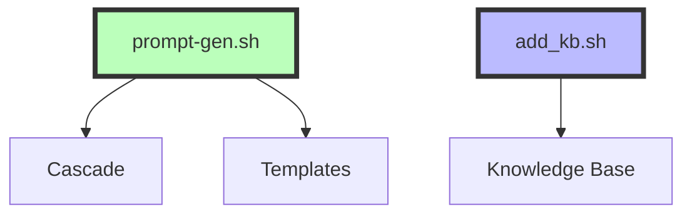
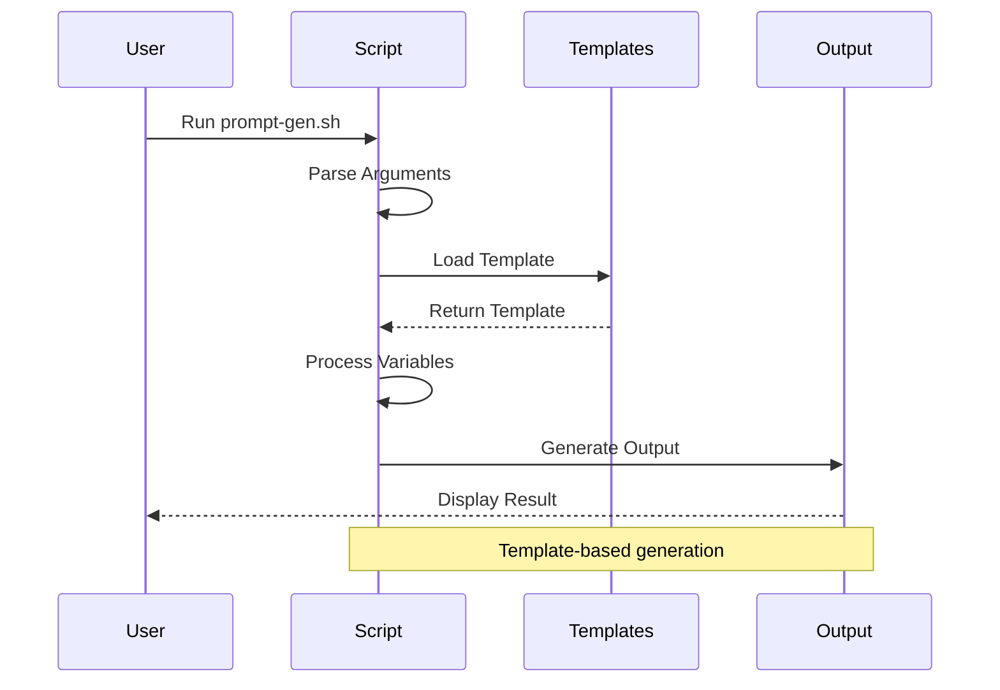
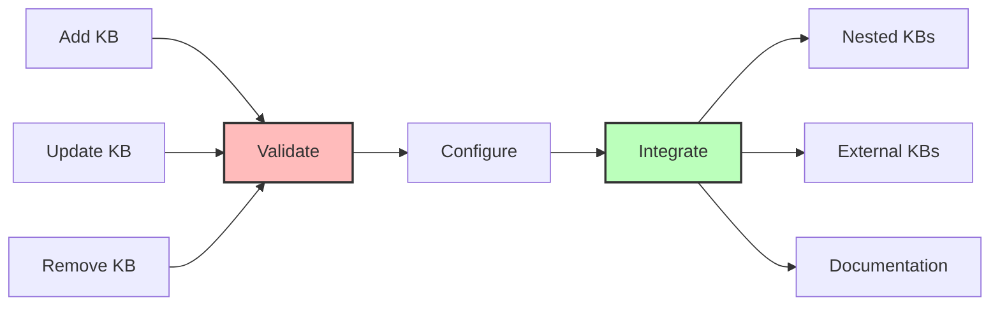

# Scripts

Collection of utility scripts for the knowledge base system.

## System Overview



## Workflow Diagrams

### Prompt Generator Workflow


### Knowledge Base Management


## Available Scripts

### 1. Prompt Generator (`prompt-gen.sh`)

A powerful CLI tool for generating structured prompts using templates.

#### Features
- Template-based generation
- Multiple output formats
- Interactive mode
- Debug support
- Colored output
- Timestamp metadata

#### Usage

```bash
# Make script executable
chmod +x prompt-gen.sh

# Basic usage
./prompt-gen.sh "Task description" "Requirement1" "Requirement2"

# With options
./prompt-gen.sh -t api_docs -f xml "Create API" "Include auth"
```

#### Options
- `-t, --template NAME` - Use specific template
- `-f, --format FORMAT` - Output format (xml, json, markdown)
- `-i, --interactive` - Interactive mode
- `-d, --debug` - Debug mode
- `-h, --help` - Show help

#### Examples

1. **Basic Usage**
   ```bash
   ./prompt-gen.sh "Create API docs" "Include endpoints" "Show examples"
   ```

2. **With Template**
   ```bash
   ./prompt-gen.sh -t api_docs "Document REST API" "Include auth"
   ```

3. **Interactive Mode**
   ```bash
   ./prompt-gen.sh -i "Create documentation"
   ```

4. **Debug Mode**
   ```bash
   ./prompt-gen.sh -d "Analyze code" "Security check"
   ```

### 2. Knowledge Base Manager (`add_kb.sh`)

Script for managing knowledge base additions and configurations.

#### Usage
```bash
# Add a new knowledge base
./add_kb.sh <repository-url> <kb-name>

# Example
./add_kb.sh https://github.com/org/their-kb.git awesome-kb
```

## Integration

### With Cascade
The prompt generator is integrated with Cascade through the `/prompt` command:

```bash
# In Cascade chat
/prompt create API docs include-endpoints show-examples
```

### With Knowledge Base
Scripts are designed to work seamlessly with the knowledge base structure:
- Templates in `prompting/claude/prompt_generator/templates/`
- Configuration in `prompting/claude/prompt_generator/config.json`
- Documentation in respective README files

## Best Practices

1. **Script Usage**
   - Make scripts executable before use
   - Use absolute paths when necessary
   - Follow the examples in help text
   - Use debug mode for troubleshooting

2. **Template Management**
   - Use appropriate templates for tasks
   - Create custom templates as needed
   - Validate templates before use
   - Document template purposes

3. **Integration**
   - Use scripts through Cascade when possible
   - Keep documentation updated
   - Follow version control practices
   - Report issues and bugs

## Troubleshooting

1. **Script Not Found**
   ```bash
   # Add to PATH
   export PATH="$PATH:$HOME/knowledge-bases/kb-nahum-jeff-shared/scripts"
   ```

2. **Permission Denied**
   ```bash
   # Make executable
   chmod +x scripts/*.sh
   ```

3. **Template Errors**
   ```bash
   # Debug mode
   ./prompt-gen.sh -d "Task" "Requirement"
   ```

## Contributing

1. Make scripts executable
2. Follow shell script best practices
3. Add comprehensive documentation
4. Include usage examples
5. Update README as needed
